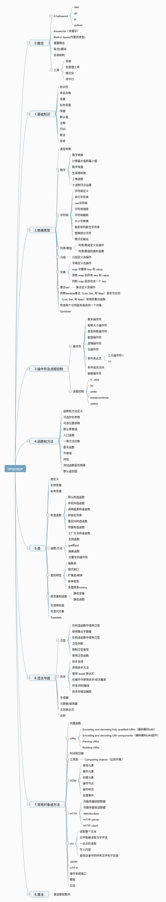

# 编程语言学习对比速查

- [0.概览](./0.概览.md)
- [1.基础知识](./1.基础知识.md)
- [2.数据类型](./2.数据类型.md)
- [3.操作符及流程控制](./3.操作符及流程控制.md)
- [4.函数和方法](./4.函数和方法.md)
- [5.类](./5.类.md)
- [6.语法专题](./6.语法专题.md)
- [7.常用对象或方法](./7.常用对象或方法.md)
- [8.算法](./8.算法.md)

