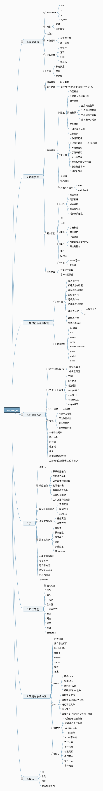

# 编程语言 对比学习/速查笔记

- [1.基础知识](./src/1.%E5%9F%BA%E7%A1%80%E7%9F%A5%E8%AF%86.md)
  - [hello](./src/1.%E5%9F%BA%E7%A1%80%E7%9F%A5%E8%AF%86.md#hello)
  - [helloword](./src/1.%E5%9F%BA%E7%A1%80%E7%9F%A5%E8%AF%86.md#helloword)
    - [dart](./src/1.%E5%9F%BA%E7%A1%80%E7%9F%A5%E8%AF%86.md#dart)
    - [go](./src/1.%E5%9F%BA%E7%A1%80%E7%9F%A5%E8%AF%86.md#go)
    - [js](./src/1.%E5%9F%BA%E7%A1%80%E7%9F%A5%E8%AF%86.md#js)
    - [python](./src/1.%E5%9F%BA%E7%A1%80%E7%9F%A5%E8%AF%86.md#python)
  - [概念](./src/1.%E5%9F%BA%E7%A1%80%E7%9F%A5%E8%AF%86.md#%E6%A6%82%E5%BF%B5)
    - [安装](./src/1.%E5%9F%BA%E7%A1%80%E7%9F%A5%E8%AF%86.md#%E5%AE%89%E8%A3%85)
    - [常用命令](./src/1.%E5%9F%BA%E7%A1%80%E7%9F%A5%E8%AF%86.md#%E5%B8%B8%E7%94%A8%E5%91%BD%E4%BB%A4)
  - [保留字](./src/1.%E5%9F%BA%E7%A1%80%E7%9F%A5%E8%AF%86.md#%E4%BF%9D%E7%95%99%E5%AD%97)
  - [库包模块](./src/1.%E5%9F%BA%E7%A1%80%E7%9F%A5%E8%AF%86.md#%E5%BA%93%E5%8C%85%E6%A8%A1%E5%9D%97)
    - [包管理工具](./src/1.%E5%9F%BA%E7%A1%80%E7%9F%A5%E8%AF%86.md#%E5%8C%85%E7%AE%A1%E7%90%86%E5%B7%A5%E5%85%B7)
    - [项目结构](./src/1.%E5%9F%BA%E7%A1%80%E7%9F%A5%E8%AF%86.md#%E9%A1%B9%E7%9B%AE%E7%BB%93%E6%9E%84)
  - [命名风格](./src/1.%E5%9F%BA%E7%A1%80%E7%9F%A5%E8%AF%86.md#%E5%91%BD%E5%90%8D%E9%A3%8E%E6%A0%BC)
    - [标识符](./src/1.%E5%9F%BA%E7%A1%80%E7%9F%A5%E8%AF%86.md#%E6%A0%87%E8%AF%86%E7%AC%A6)
    - [注释](./src/1.%E5%9F%BA%E7%A1%80%E7%9F%A5%E8%AF%86.md#%E6%B3%A8%E9%87%8A)
    - [打印](./src/1.%E5%9F%BA%E7%A1%80%E7%9F%A5%E8%AF%86.md#%E6%89%93%E5%8D%B0)
    - [格式化](./src/1.%E5%9F%BA%E7%A1%80%E7%9F%A5%E8%AF%86.md#%E6%A0%BC%E5%BC%8F%E5%8C%96)
  - [变量](./src/1.%E5%9F%BA%E7%A1%80%E7%9F%A5%E8%AF%86.md#%E5%8F%98%E9%87%8F)
    - [私有变量](./src/1.%E5%9F%BA%E7%A1%80%E7%9F%A5%E8%AF%86.md#%E7%A7%81%E6%9C%89%E5%8F%98%E9%87%8F)
    - [常量](./src/1.%E5%9F%BA%E7%A1%80%E7%9F%A5%E8%AF%86.md#%E5%B8%B8%E9%87%8F)
    - [默认值](./src/1.%E5%9F%BA%E7%A1%80%E7%9F%A5%E8%AF%86.md#%E9%BB%98%E8%AE%A4%E5%80%BC)
- [2.数据类型](./src/2.%E6%95%B0%E6%8D%AE%E7%B1%BB%E5%9E%8B.md)
  - [内置类型](./src/2.%E6%95%B0%E6%8D%AE%E7%B1%BB%E5%9E%8B.md#%E5%86%85%E7%BD%AE%E7%B1%BB%E5%9E%8B)
    - [默认类型](./src/2.%E6%95%B0%E6%8D%AE%E7%B1%BB%E5%9E%8B.md#%E9%BB%98%E8%AE%A4%E7%B1%BB%E5%9E%8B)
  - [类型判断](./src/2.%E6%95%B0%E6%8D%AE%E7%B1%BB%E5%9E%8B.md#%E7%B1%BB%E5%9E%8B%E5%88%A4%E6%96%AD)
    - [检查两个引用是否指向同一个对象](./src/2.%E6%95%B0%E6%8D%AE%E7%B1%BB%E5%9E%8B.md#%E6%A3%80%E6%9F%A5%E4%B8%A4%E4%B8%AA%E5%BC%95%E7%94%A8%E6%98%AF%E5%90%A6%E6%8C%87%E5%90%91%E5%90%8C%E4%B8%80%E4%B8%AA%E5%AF%B9%E8%B1%A1)
  - [基本类型](./src/2.%E6%95%B0%E6%8D%AE%E7%B1%BB%E5%9E%8B.md#%E5%9F%BA%E6%9C%AC%E7%B1%BB%E5%9E%8B)
    - [数值](./src/2.%E6%95%B0%E6%8D%AE%E7%B1%BB%E5%9E%8B.md#%E6%95%B0%E5%80%BC)
      - [数值操作](./src/2.%E6%95%B0%E6%8D%AE%E7%B1%BB%E5%9E%8B.md#%E6%95%B0%E5%80%BC%E6%93%8D%E4%BD%9C)
      - [计算最大值和最小值](./src/2.%E6%95%B0%E6%8D%AE%E7%B1%BB%E5%9E%8B.md#%E8%AE%A1%E7%AE%97%E6%9C%80%E5%A4%A7%E5%80%BC%E5%92%8C%E6%9C%80%E5%B0%8F%E5%80%BC)
      - [数学常量](./src/2.%E6%95%B0%E6%8D%AE%E7%B1%BB%E5%9E%8B.md#%E6%95%B0%E5%AD%A6%E5%B8%B8%E9%87%8F)
      - [随机数](./src/2.%E6%95%B0%E6%8D%AE%E7%B1%BB%E5%9E%8B.md#%E9%9A%8F%E6%9C%BA%E6%95%B0)
        - [生成随机整数](./src/2.%E6%95%B0%E6%8D%AE%E7%B1%BB%E5%9E%8B.md#%E7%94%9F%E6%88%90%E9%9A%8F%E6%9C%BA%E6%95%B4%E6%95%B0)
        - [生成随机布尔值](./src/2.%E6%95%B0%E6%8D%AE%E7%B1%BB%E5%9E%8B.md#%E7%94%9F%E6%88%90%E9%9A%8F%E6%9C%BA%E5%B8%83%E5%B0%94%E5%80%BC)
        - [生成随机字符串](./src/2.%E6%95%B0%E6%8D%AE%E7%B1%BB%E5%9E%8B.md#%E7%94%9F%E6%88%90%E9%9A%8F%E6%9C%BA%E5%AD%97%E7%AC%A6%E4%B8%B2)
        - [随机选择子对象](./src/2.%E6%95%B0%E6%8D%AE%E7%B1%BB%E5%9E%8B.md#%E9%9A%8F%E6%9C%BA%E9%80%89%E6%8B%A9%E5%AD%90%E5%AF%B9%E8%B1%A1)
      - [三角函数](./src/2.%E6%95%B0%E6%8D%AE%E7%B1%BB%E5%9E%8B.md#%E4%B8%89%E8%A7%92%E5%87%BD%E6%95%B0)
      - [十进制浮点运算](./src/2.%E6%95%B0%E6%8D%AE%E7%B1%BB%E5%9E%8B.md#%E5%8D%81%E8%BF%9B%E5%88%B6%E6%B5%AE%E7%82%B9%E8%BF%90%E7%AE%97)
      - [进制转换](./src/2.%E6%95%B0%E6%8D%AE%E7%B1%BB%E5%9E%8B.md#%E8%BF%9B%E5%88%B6%E8%BD%AC%E6%8D%A2)
    - [字符串](./src/2.%E6%95%B0%E6%8D%AE%E7%B1%BB%E5%9E%8B.md#%E5%AD%97%E7%AC%A6%E4%B8%B2)
      - [多行字符串](./src/2.%E6%95%B0%E6%8D%AE%E7%B1%BB%E5%9E%8B.md#%E5%A4%9A%E8%A1%8C%E5%AD%97%E7%AC%A6%E4%B8%B2)
      - [字符串前缀](./src/2.%E6%95%B0%E6%8D%AE%E7%B1%BB%E5%9E%8B.md#%E5%AD%97%E7%AC%A6%E4%B8%B2%E5%89%8D%E7%BC%80)
        - [原始字符串](./src/2.%E6%95%B0%E6%8D%AE%E7%B1%BB%E5%9E%8B.md#%E5%8E%9F%E5%A7%8B%E5%AD%97%E7%AC%A6%E4%B8%B2)
      - [字符串搜索](./src/2.%E6%95%B0%E6%8D%AE%E7%B1%BB%E5%9E%8B.md#%E5%AD%97%E7%AC%A6%E4%B8%B2%E6%90%9C%E7%B4%A2)
      - [字符串截取](./src/2.%E6%95%B0%E6%8D%AE%E7%B1%BB%E5%9E%8B.md#%E5%AD%97%E7%AC%A6%E4%B8%B2%E6%88%AA%E5%8F%96)
      - [大小写转换](./src/2.%E6%95%B0%E6%8D%AE%E7%B1%BB%E5%9E%8B.md#%E5%A4%A7%E5%B0%8F%E5%86%99%E8%BD%AC%E6%8D%A2)
      - [裁剪和判断空字符串](./src/2.%E6%95%B0%E6%8D%AE%E7%B1%BB%E5%9E%8B.md#%E8%A3%81%E5%89%AA%E5%92%8C%E5%88%A4%E6%96%AD%E7%A9%BA%E5%AD%97%E7%AC%A6%E4%B8%B2)
      - [替换部分字符](./src/2.%E6%95%B0%E6%8D%AE%E7%B1%BB%E5%9E%8B.md#%E6%9B%BF%E6%8D%A2%E9%83%A8%E5%88%86%E5%AD%97%E7%AC%A6)
      - [格式化输出](./src/2.%E6%95%B0%E6%8D%AE%E7%B1%BB%E5%9E%8B.md#%E6%A0%BC%E5%BC%8F%E5%8C%96%E8%BE%93%E5%87%BA)
    - [Symbols](./src/2.%E6%95%B0%E6%8D%AE%E7%B1%BB%E5%9E%8B.md#Symbols)
    - [其他基本类型](./src/2.%E6%95%B0%E6%8D%AE%E7%B1%BB%E5%9E%8B.md#%E5%85%B6%E4%BB%96%E5%9F%BA%E6%9C%AC%E7%B1%BB%E5%9E%8B)
      - [null](./src/2.%E6%95%B0%E6%8D%AE%E7%B1%BB%E5%9E%8B.md#null)
      - [undefined](./src/2.%E6%95%B0%E6%8D%AE%E7%B1%BB%E5%9E%8B.md#undefined)
  - [复杂类型](./src/2.%E6%95%B0%E6%8D%AE%E7%B1%BB%E5%9E%8B.md#%E5%A4%8D%E6%9D%82%E7%B1%BB%E5%9E%8B)
    - [列表](./src/2.%E6%95%B0%E6%8D%AE%E7%B1%BB%E5%9E%8B.md#%E5%88%97%E8%A1%A8)
      - [列表查找](./src/2.%E6%95%B0%E6%8D%AE%E7%B1%BB%E5%9E%8B.md#%E5%88%97%E8%A1%A8%E6%9F%A5%E6%89%BE)
      - [列表排序](./src/2.%E6%95%B0%E6%8D%AE%E7%B1%BB%E5%9E%8B.md#%E5%88%97%E8%A1%A8%E6%8E%92%E5%BA%8F)
      - [列表截取](./src/2.%E6%95%B0%E6%8D%AE%E7%B1%BB%E5%9E%8B.md#%E5%88%97%E8%A1%A8%E6%88%AA%E5%8F%96)
      - [列表推导式](./src/2.%E6%95%B0%E6%8D%AE%E7%B1%BB%E5%9E%8B.md#%E5%88%97%E8%A1%A8%E6%8E%A8%E5%AF%BC%E5%BC%8F)
      - [列表高阶函数](./src/2.%E6%95%B0%E6%8D%AE%E7%B1%BB%E5%9E%8B.md#%E5%88%97%E8%A1%A8%E9%AB%98%E9%98%B6%E5%87%BD%E6%95%B0)
    - [切片](./src/2.%E6%95%B0%E6%8D%AE%E7%B1%BB%E5%9E%8B.md#%E5%88%87%E7%89%87)
    - [元组](./src/2.%E6%95%B0%E6%8D%AE%E7%B1%BB%E5%9E%8B.md#%E5%85%83%E7%BB%84)
    - [字典](./src/2.%E6%95%B0%E6%8D%AE%E7%B1%BB%E5%9E%8B.md#%E5%AD%97%E5%85%B8)
      - [字典删除](./src/2.%E6%95%B0%E6%8D%AE%E7%B1%BB%E5%9E%8B.md#%E5%AD%97%E5%85%B8%E5%88%A0%E9%99%A4)
      - [字典遍历](./src/2.%E6%95%B0%E6%8D%AE%E7%B1%BB%E5%9E%8B.md#%E5%AD%97%E5%85%B8%E9%81%8D%E5%8E%86)
      - [字典判断](./src/2.%E6%95%B0%E6%8D%AE%E7%B1%BB%E5%9E%8B.md#%E5%AD%97%E5%85%B8%E5%88%A4%E6%96%AD)
    - [集合](./src/2.%E6%95%B0%E6%8D%AE%E7%B1%BB%E5%9E%8B.md#%E9%9B%86%E5%90%88)
      - [判断集合是否为空](./src/2.%E6%95%B0%E6%8D%AE%E7%B1%BB%E5%9E%8B.md#%E5%88%A4%E6%96%AD%E9%9B%86%E5%90%88%E6%98%AF%E5%90%A6%E4%B8%BA%E7%A9%BA)
      - [集合的比较](./src/2.%E6%95%B0%E6%8D%AE%E7%B1%BB%E5%9E%8B.md#%E9%9B%86%E5%90%88%E7%9A%84%E6%AF%94%E8%BE%83)
    - [指针](./src/2.%E6%95%B0%E6%8D%AE%E7%B1%BB%E5%9E%8B.md#%E6%8C%87%E9%92%88)
    - [结构体](./src/2.%E6%95%B0%E6%8D%AE%E7%B1%BB%E5%9E%8B.md#%E7%BB%93%E6%9E%84%E4%BD%93)
    - [信道](./src/2.%E6%95%B0%E6%8D%AE%E7%B1%BB%E5%9E%8B.md#%E4%BF%A1%E9%81%93)
      - [select语句](./src/2.%E6%95%B0%E6%8D%AE%E7%B1%BB%E5%9E%8B.md#select%E8%AF%AD%E5%8F%A5)
      - [互斥锁](./src/2.%E6%95%B0%E6%8D%AE%E7%B1%BB%E5%9E%8B.md#%E4%BA%92%E6%96%A5%E9%94%81)
  - [类型转换](./src/2.%E6%95%B0%E6%8D%AE%E7%B1%BB%E5%9E%8B.md#%E7%B1%BB%E5%9E%8B%E8%BD%AC%E6%8D%A2)
    - [数值转字符串](./src/2.%E6%95%B0%E6%8D%AE%E7%B1%BB%E5%9E%8B.md#%E6%95%B0%E5%80%BC%E8%BD%AC%E5%AD%97%E7%AC%A6%E4%B8%B2)
    - [字符串转数值](./src/2.%E6%95%B0%E6%8D%AE%E7%B1%BB%E5%9E%8B.md#%E5%AD%97%E7%AC%A6%E4%B8%B2%E8%BD%AC%E6%95%B0%E5%80%BC)
- [3.操作符及流程控制](./src/3.%E6%93%8D%E4%BD%9C%E7%AC%A6%E5%8F%8A%E6%B5%81%E7%A8%8B%E6%8E%A7%E5%88%B6.md)
  - [操作符](./src/3.%E6%93%8D%E4%BD%9C%E7%AC%A6%E5%8F%8A%E6%B5%81%E7%A8%8B%E6%8E%A7%E5%88%B6.md#%E6%93%8D%E4%BD%9C%E7%AC%A6)
    - [算术操作符](./src/3.%E6%93%8D%E4%BD%9C%E7%AC%A6%E5%8F%8A%E6%B5%81%E7%A8%8B%E6%8E%A7%E5%88%B6.md#%E7%AE%97%E6%9C%AF%E6%93%8D%E4%BD%9C%E7%AC%A6)
    - [相等大小操作符](./src/3.%E6%93%8D%E4%BD%9C%E7%AC%A6%E5%8F%8A%E6%B5%81%E7%A8%8B%E6%8E%A7%E5%88%B6.md#%E7%9B%B8%E7%AD%89%E5%A4%A7%E5%B0%8F%E6%93%8D%E4%BD%9C%E7%AC%A6)
    - [类型判断操作符](./src/3.%E6%93%8D%E4%BD%9C%E7%AC%A6%E5%8F%8A%E6%B5%81%E7%A8%8B%E6%8E%A7%E5%88%B6.md#%E7%B1%BB%E5%9E%8B%E5%88%A4%E6%96%AD%E6%93%8D%E4%BD%9C%E7%AC%A6)
    - [赋值操作符](./src/3.%E6%93%8D%E4%BD%9C%E7%AC%A6%E5%8F%8A%E6%B5%81%E7%A8%8B%E6%8E%A7%E5%88%B6.md#%E8%B5%8B%E5%80%BC%E6%93%8D%E4%BD%9C%E7%AC%A6)
    - [逻辑操作符](./src/3.%E6%93%8D%E4%BD%9C%E7%AC%A6%E5%8F%8A%E6%B5%81%E7%A8%8B%E6%8E%A7%E5%88%B6.md#%E9%80%BB%E8%BE%91%E6%93%8D%E4%BD%9C%E7%AC%A6)
    - [位和移位操作符](./src/3.%E6%93%8D%E4%BD%9C%E7%AC%A6%E5%8F%8A%E6%B5%81%E7%A8%8B%E6%8E%A7%E5%88%B6.md#%E4%BD%8D%E5%92%8C%E7%A7%BB%E4%BD%8D%E6%93%8D%E4%BD%9C%E7%AC%A6)
    - [条件表达式](./src/3.%E6%93%8D%E4%BD%9C%E7%AC%A6%E5%8F%8A%E6%B5%81%E7%A8%8B%E6%8E%A7%E5%88%B6.md#%E6%9D%A1%E4%BB%B6%E8%A1%A8%E8%BE%BE%E5%BC%8F)
    - [级联操作符](./src/3.%E6%93%8D%E4%BD%9C%E7%AC%A6%E5%8F%8A%E6%B5%81%E7%A8%8B%E6%8E%A7%E5%88%B6.md#%E7%BA%A7%E8%81%94%E6%93%8D%E4%BD%9C%E7%AC%A6)
    - [条件成员访问](./src/3.%E6%93%8D%E4%BD%9C%E7%AC%A6%E5%8F%8A%E6%B5%81%E7%A8%8B%E6%8E%A7%E5%88%B6.md#%E6%9D%A1%E4%BB%B6%E6%88%90%E5%91%98%E8%AE%BF%E9%97%AE)
  - [流程控制](./src/3.%E6%93%8D%E4%BD%9C%E7%AC%A6%E5%8F%8A%E6%B5%81%E7%A8%8B%E6%8E%A7%E5%88%B6.md#%E6%B5%81%E7%A8%8B%E6%8E%A7%E5%88%B6)
    - [IfElse](./src/3.%E6%93%8D%E4%BD%9C%E7%AC%A6%E5%8F%8A%E6%B5%81%E7%A8%8B%E6%8E%A7%E5%88%B6.md#IfElse)
    - [For](./src/3.%E6%93%8D%E4%BD%9C%E7%AC%A6%E5%8F%8A%E6%B5%81%E7%A8%8B%E6%8E%A7%E5%88%B6.md#For)
    - [range](./src/3.%E6%93%8D%E4%BD%9C%E7%AC%A6%E5%8F%8A%E6%B5%81%E7%A8%8B%E6%8E%A7%E5%88%B6.md#range)
    - [While](./src/3.%E6%93%8D%E4%BD%9C%E7%AC%A6%E5%8F%8A%E6%B5%81%E7%A8%8B%E6%8E%A7%E5%88%B6.md#While)
    - [BreakContinue](./src/3.%E6%93%8D%E4%BD%9C%E7%AC%A6%E5%8F%8A%E6%B5%81%E7%A8%8B%E6%8E%A7%E5%88%B6.md#BreakContinue)
    - [pass](./src/3.%E6%93%8D%E4%BD%9C%E7%AC%A6%E5%8F%8A%E6%B5%81%E7%A8%8B%E6%8E%A7%E5%88%B6.md#pass)
    - [Switch](./src/3.%E6%93%8D%E4%BD%9C%E7%AC%A6%E5%8F%8A%E6%B5%81%E7%A8%8B%E6%8E%A7%E5%88%B6.md#Switch)
    - [defer](./src/3.%E6%93%8D%E4%BD%9C%E7%AC%A6%E5%8F%8A%E6%B5%81%E7%A8%8B%E6%8E%A7%E5%88%B6.md#defer)
- [4.函数和方法](./src/4.%E5%87%BD%E6%95%B0%E5%92%8C%E6%96%B9%E6%B3%95.md)
  - [函数和方法定义](./src/4.%E5%87%BD%E6%95%B0%E5%92%8C%E6%96%B9%E6%B3%95.md#%E5%87%BD%E6%95%B0%E5%92%8C%E6%96%B9%E6%B3%95%E5%AE%9A%E4%B9%89)
    - [默认返回值](./src/4.%E5%87%BD%E6%95%B0%E5%92%8C%E6%96%B9%E6%B3%95.md#%E9%BB%98%E8%AE%A4%E8%BF%94%E5%9B%9E%E5%80%BC)
    - [命名返回值](./src/4.%E5%87%BD%E6%95%B0%E5%92%8C%E6%96%B9%E6%B3%95.md#%E5%91%BD%E5%90%8D%E8%BF%94%E5%9B%9E%E5%80%BC)
  - [方法](./src/4.%E5%87%BD%E6%95%B0%E5%92%8C%E6%96%B9%E6%B3%95.md#%E6%96%B9%E6%B3%95)
    - [接口](./src/4.%E5%87%BD%E6%95%B0%E5%92%8C%E6%96%B9%E6%B3%95.md#%E6%8E%A5%E5%8F%A3)
      - [空接口](./src/4.%E5%87%BD%E6%95%B0%E5%92%8C%E6%96%B9%E6%B3%95.md#%E7%A9%BA%E6%8E%A5%E5%8F%A3)
      - [类型断言](./src/4.%E5%87%BD%E6%95%B0%E5%92%8C%E6%96%B9%E6%B3%95.md#%E7%B1%BB%E5%9E%8B%E6%96%AD%E8%A8%80)
      - [类型选择](./src/4.%E5%87%BD%E6%95%B0%E5%92%8C%E6%96%B9%E6%B3%95.md#%E7%B1%BB%E5%9E%8B%E9%80%89%E6%8B%A9)
      - [Stringer接口](./src/4.%E5%87%BD%E6%95%B0%E5%92%8C%E6%96%B9%E6%B3%95.md#Stringer%E6%8E%A5%E5%8F%A3)
      - [error接口](./src/4.%E5%87%BD%E6%95%B0%E5%92%8C%E6%96%B9%E6%B3%95.md#error%E6%8E%A5%E5%8F%A3)
      - [Reader接口](./src/4.%E5%87%BD%E6%95%B0%E5%92%8C%E6%96%B9%E6%B3%95.md#Reader%E6%8E%A5%E5%8F%A3)
      - [Image接口](./src/4.%E5%87%BD%E6%95%B0%E5%92%8C%E6%96%B9%E6%B3%95.md#Image%E6%8E%A5%E5%8F%A3)
  - [入口函数](./src/4.%E5%87%BD%E6%95%B0%E5%92%8C%E6%96%B9%E6%B3%95.md#%E5%85%A5%E5%8F%A3%E5%87%BD%E6%95%B0)
    - [init函数](./src/4.%E5%87%BD%E6%95%B0%E5%92%8C%E6%96%B9%E6%B3%95.md#init%E5%87%BD%E6%95%B0)
  - [参数](./src/4.%E5%87%BD%E6%95%B0%E5%92%8C%E6%96%B9%E6%B3%95.md#%E5%8F%82%E6%95%B0)
    - [可选命名参数](./src/4.%E5%87%BD%E6%95%B0%E5%92%8C%E6%96%B9%E6%B3%95.md#%E5%8F%AF%E9%80%89%E5%91%BD%E5%90%8D%E5%8F%82%E6%95%B0)
    - [可选位置参数](./src/4.%E5%87%BD%E6%95%B0%E5%92%8C%E6%96%B9%E6%B3%95.md#%E5%8F%AF%E9%80%89%E4%BD%8D%E7%BD%AE%E5%8F%82%E6%95%B0)
    - [默认参数值](./src/4.%E5%87%BD%E6%95%B0%E5%92%8C%E6%96%B9%E6%B3%95.md#%E9%BB%98%E8%AE%A4%E5%8F%82%E6%95%B0%E5%80%BC)
    - [解包参数列表](./src/4.%E5%87%BD%E6%95%B0%E5%92%8C%E6%96%B9%E6%B3%95.md#%E8%A7%A3%E5%8C%85%E5%8F%82%E6%95%B0%E5%88%97%E8%A1%A8)
  - [一等方法对象](./src/4.%E5%87%BD%E6%95%B0%E5%92%8C%E6%96%B9%E6%B3%95.md#%E4%B8%80%E7%AD%89%E6%96%B9%E6%B3%95%E5%AF%B9%E8%B1%A1)
  - [匿名函数](./src/4.%E5%87%BD%E6%95%B0%E5%92%8C%E6%96%B9%E6%B3%95.md#%E5%8C%BF%E5%90%8D%E5%87%BD%E6%95%B0)
  - [函数标注](./src/4.%E5%87%BD%E6%95%B0%E5%92%8C%E6%96%B9%E6%B3%95.md#%E5%87%BD%E6%95%B0%E6%A0%87%E6%B3%A8)
  - [作用域](./src/4.%E5%87%BD%E6%95%B0%E5%92%8C%E6%96%B9%E6%B3%95.md#%E4%BD%9C%E7%94%A8%E5%9F%9F)
  - [闭包](./src/4.%E5%87%BD%E6%95%B0%E5%92%8C%E6%96%B9%E6%B3%95.md#%E9%97%AD%E5%8C%85)
  - [测试函数是否相等](./src/4.%E5%87%BD%E6%95%B0%E5%92%8C%E6%96%B9%E6%B3%95.md#%E6%B5%8B%E8%AF%95%E5%87%BD%E6%95%B0%E6%98%AF%E5%90%A6%E7%9B%B8%E7%AD%89)
  - [立即调用的函数表达式](./src/4.%E5%87%BD%E6%95%B0%E5%92%8C%E6%96%B9%E6%B3%95.md#%E7%AB%8B%E5%8D%B3%E8%B0%83%E7%94%A8%E7%9A%84%E5%87%BD%E6%95%B0%E8%A1%A8%E8%BE%BE%E5%BC%8F)
- [5.类](./src/5.%E7%B1%BB.md)
  - [类定义](./src/5.%E7%B1%BB.md#%E7%B1%BB%E5%AE%9A%E4%B9%89)
  - [构造函数](./src/5.%E7%B1%BB.md#%E6%9E%84%E9%80%A0%E5%87%BD%E6%95%B0)
    - [默认构造函数](./src/5.%E7%B1%BB.md#%E9%BB%98%E8%AE%A4%E6%9E%84%E9%80%A0%E5%87%BD%E6%95%B0)
    - [命名构造函数](./src/5.%E7%B1%BB.md#%E5%91%BD%E5%90%8D%E6%9E%84%E9%80%A0%E5%87%BD%E6%95%B0)
    - [调用超类构造函数](./src/5.%E7%B1%BB.md#%E8%B0%83%E7%94%A8%E8%B6%85%E7%B1%BB%E6%9E%84%E9%80%A0%E5%87%BD%E6%95%B0)
    - [初始化列表](./src/5.%E7%B1%BB.md#%E5%88%9D%E5%A7%8B%E5%8C%96%E5%88%97%E8%A1%A8)
    - [重定向构造函数](./src/5.%E7%B1%BB.md#%E9%87%8D%E5%AE%9A%E5%90%91%E6%9E%84%E9%80%A0%E5%87%BD%E6%95%B0)
    - [常量构造函数](./src/5.%E7%B1%BB.md#%E5%B8%B8%E9%87%8F%E6%9E%84%E9%80%A0%E5%87%BD%E6%95%B0)
    - [工厂方法构造函数](./src/5.%E7%B1%BB.md#%E5%B7%A5%E5%8E%82%E6%96%B9%E6%B3%95%E6%9E%84%E9%80%A0%E5%87%BD%E6%95%B0)
  - [实例变量和方法](./src/5.%E7%B1%BB.md#%E5%AE%9E%E4%BE%8B%E5%8F%98%E9%87%8F%E5%92%8C%E6%96%B9%E6%B3%95)
    - [实例变量](./src/5.%E7%B1%BB.md#%E5%AE%9E%E4%BE%8B%E5%8F%98%E9%87%8F)
    - [实例方法](./src/5.%E7%B1%BB.md#%E5%AE%9E%E4%BE%8B%E6%96%B9%E6%B3%95)
    - [get和set](./src/5.%E7%B1%BB.md#get%E5%92%8Cset)
  - [类变量和方法](./src/5.%E7%B1%BB.md#%E7%B1%BB%E5%8F%98%E9%87%8F%E5%92%8C%E6%96%B9%E6%B3%95)
    - [静态变量](./src/5.%E7%B1%BB.md#%E9%9D%99%E6%80%81%E5%8F%98%E9%87%8F)
    - [静态方法](./src/5.%E7%B1%BB.md#%E9%9D%99%E6%80%81%E6%96%B9%E6%B3%95)
  - [抽象及继承](./src/5.%E7%B1%BB.md#%E6%8A%BD%E8%B1%A1%E5%8F%8A%E7%BB%A7%E6%89%BF)
    - [抽象类](./src/5.%E7%B1%BB.md#%E6%8A%BD%E8%B1%A1%E7%B1%BB)
    - [抽象函数](./src/5.%E7%B1%BB.md#%E6%8A%BD%E8%B1%A1%E5%87%BD%E6%95%B0)
    - [隐式接口](./src/5.%E7%B1%BB.md#%E9%9A%90%E5%BC%8F%E6%8E%A5%E5%8F%A3)
    - [继承](./src/5.%E7%B1%BB.md#%E7%BB%A7%E6%89%BF)
    - [多重继承](./src/5.%E7%B1%BB.md#%E5%A4%9A%E9%87%8D%E7%BB%A7%E6%89%BF)
    - [混入](./src/5.%E7%B1%BB.md#%E6%B7%B7%E5%85%A5)
  - [可覆写的操作符](./src/5.%E7%B1%BB.md#%E5%8F%AF%E8%A6%86%E5%86%99%E7%9A%84%E6%93%8D%E4%BD%9C%E7%AC%A6)
  - [枚举类型](./src/5.%E7%B1%BB.md#%E6%9E%9A%E4%B8%BE%E7%B1%BB%E5%9E%8B)
  - [可调用的类](./src/5.%E7%B1%BB.md#%E5%8F%AF%E8%B0%83%E7%94%A8%E7%9A%84%E7%B1%BB)
  - [自定义hash码](./src/5.%E7%B1%BB.md#%E8%87%AA%E5%AE%9A%E4%B9%89hash%E7%A0%81)
  - [可迭代对象](./src/5.%E7%B1%BB.md#%E5%8F%AF%E8%BF%AD%E4%BB%A3%E5%AF%B9%E8%B1%A1)
  - [Typedefs](./src/5.%E7%B1%BB.md#Typedefs)
- [6.语法专题](./src/6.%E8%AF%AD%E6%B3%95%E4%B8%93%E9%A2%98.md)
  - [面向对象](./src/6.%E8%AF%AD%E6%B3%95%E4%B8%93%E9%A2%98.md#%E9%9D%A2%E5%90%91%E5%AF%B9%E8%B1%A1)
    - [new命令](./src/6.%E8%AF%AD%E6%B3%95%E4%B8%93%E9%A2%98.md#new%E5%91%BD%E4%BB%A4)
    - [this关键字](./src/6.%E8%AF%AD%E6%B3%95%E4%B8%93%E9%A2%98.md#this%E5%85%B3%E9%94%AE%E5%AD%97)
    - [原型链](./src/6.%E8%AF%AD%E6%B3%95%E4%B8%93%E9%A2%98.md#%E5%8E%9F%E5%9E%8B%E9%93%BE)
    - [获取对象的所有属性](./src/6.%E8%AF%AD%E6%B3%95%E4%B8%93%E9%A2%98.md#%E8%8E%B7%E5%8F%96%E5%AF%B9%E8%B1%A1%E7%9A%84%E6%89%80%E6%9C%89%E5%B1%9E%E6%80%A7)
    - [对象的拷贝](./src/6.%E8%AF%AD%E6%B3%95%E4%B8%93%E9%A2%98.md#%E5%AF%B9%E8%B1%A1%E7%9A%84%E6%8B%B7%E8%B4%9D)
    - [比较对象](./src/6.%E8%AF%AD%E6%B3%95%E4%B8%93%E9%A2%98.md#%E6%AF%94%E8%BE%83%E5%AF%B9%E8%B1%A1)
  - [泛型](./src/6.%E8%AF%AD%E6%B3%95%E4%B8%93%E9%A2%98.md#%E6%B3%9B%E5%9E%8B)
    - [使用集合字面量](./src/6.%E8%AF%AD%E6%B3%95%E4%B8%93%E9%A2%98.md#%E4%BD%BF%E7%94%A8%E9%9B%86%E5%90%88%E5%AD%97%E9%9D%A2%E9%87%8F)
    - [在构造函数中使用泛型](./src/6.%E8%AF%AD%E6%B3%95%E4%B8%93%E9%A2%98.md#%E5%9C%A8%E6%9E%84%E9%80%A0%E5%87%BD%E6%95%B0%E4%B8%AD%E4%BD%BF%E7%94%A8%E6%B3%9B%E5%9E%8B)
    - [泛型判断](./src/6.%E8%AF%AD%E6%B3%95%E4%B8%93%E9%A2%98.md#%E6%B3%9B%E5%9E%8B%E5%88%A4%E6%96%AD)
    - [限制泛型类型](./src/6.%E8%AF%AD%E6%B3%95%E4%B8%93%E9%A2%98.md#%E9%99%90%E5%88%B6%E6%B3%9B%E5%9E%8B%E7%B1%BB%E5%9E%8B)
    - [使用泛型函数](./src/6.%E8%AF%AD%E6%B3%95%E4%B8%93%E9%A2%98.md#%E4%BD%BF%E7%94%A8%E6%B3%9B%E5%9E%8B%E5%87%BD%E6%95%B0)
  - [异步](./src/6.%E8%AF%AD%E6%B3%95%E4%B8%93%E9%A2%98.md#%E5%BC%82%E6%AD%A5)
    - [声明异步方法](./src/6.%E8%AF%AD%E6%B3%95%E4%B8%93%E9%A2%98.md#%E5%A3%B0%E6%98%8E%E5%BC%82%E6%AD%A5%E6%96%B9%E6%B3%95)
    - [使用await表达式](./src/6.%E8%AF%AD%E6%B3%95%E4%B8%93%E9%A2%98.md#%E4%BD%BF%E7%94%A8await%E8%A1%A8%E8%BE%BE%E5%BC%8F)
    - [在循环中使用异步](./src/6.%E8%AF%AD%E6%B3%95%E4%B8%93%E9%A2%98.md#%E5%9C%A8%E5%BE%AA%E7%8E%AF%E4%B8%AD%E4%BD%BF%E7%94%A8%E5%BC%82%E6%AD%A5)
    - [异步并发](./src/6.%E8%AF%AD%E6%B3%95%E4%B8%93%E9%A2%98.md#%E5%BC%82%E6%AD%A5%E5%B9%B6%E5%8F%91)
    - [异步的错误捕获](./src/6.%E8%AF%AD%E6%B3%95%E4%B8%93%E9%A2%98.md#%E5%BC%82%E6%AD%A5%E7%9A%84%E9%94%99%E8%AF%AF%E6%8D%95%E8%8E%B7)
  - [生成器](./src/6.%E8%AF%AD%E6%B3%95%E4%B8%93%E9%A2%98.md#%E7%94%9F%E6%88%90%E5%99%A8)
  - [装饰器](./src/6.%E8%AF%AD%E6%B3%95%E4%B8%93%E9%A2%98.md#%E8%A3%85%E9%A5%B0%E5%99%A8)
  - [正则表达式](./src/6.%E8%AF%AD%E6%B3%95%E4%B8%93%E9%A2%98.md#%E6%AD%A3%E5%88%99%E8%A1%A8%E8%BE%BE%E5%BC%8F)
  - [反射](./src/6.%E8%AF%AD%E6%B3%95%E4%B8%93%E9%A2%98.md#%E5%8F%8D%E5%B0%84)
  - [断言](./src/6.%E8%AF%AD%E6%B3%95%E4%B8%93%E9%A2%98.md#%E6%96%AD%E8%A8%80)
  - [异常](./src/6.%E8%AF%AD%E6%B3%95%E4%B8%93%E9%A2%98.md#%E5%BC%82%E5%B8%B8)
  - [测试](./src/6.%E8%AF%AD%E6%B3%95%E4%B8%93%E9%A2%98.md#%E6%B5%8B%E8%AF%95)
  - [goroutine](./src/6.%E8%AF%AD%E6%B3%95%E4%B8%93%E9%A2%98.md#goroutine)
- [7.常用对象或方法](./src/7.%E5%B8%B8%E7%94%A8%E5%AF%B9%E8%B1%A1%E6%88%96%E6%96%B9%E6%B3%95.md)
  - [内置函数](./src/7.%E5%B8%B8%E7%94%A8%E5%AF%B9%E8%B1%A1%E6%88%96%E6%96%B9%E6%B3%95.md#%E5%86%85%E7%BD%AE%E5%87%BD%E6%95%B0)
  - [操作系统接口](./src/7.%E5%B8%B8%E7%94%A8%E5%AF%B9%E8%B1%A1%E6%88%96%E6%96%B9%E6%B3%95.md#%E6%93%8D%E4%BD%9C%E7%B3%BB%E7%BB%9F%E6%8E%A5%E5%8F%A3)
  - [日期和时间](./src/7.%E5%B8%B8%E7%94%A8%E5%AF%B9%E8%B1%A1%E6%88%96%E6%96%B9%E6%B3%95.md#%E6%97%A5%E6%9C%9F%E5%92%8C%E6%97%B6%E9%97%B4)
  - [UTF-8](./src/7.%E5%B8%B8%E7%94%A8%E5%AF%B9%E8%B1%A1%E6%88%96%E6%96%B9%E6%B3%95.md#UTF-8)
  - [Base64](./src/7.%E5%B8%B8%E7%94%A8%E5%AF%B9%E8%B1%A1%E6%88%96%E6%96%B9%E6%B3%95.md#Base64)
  - [JSON](./src/7.%E5%B8%B8%E7%94%A8%E5%AF%B9%E8%B1%A1%E6%88%96%E6%96%B9%E6%B3%95.md#JSON)
  - [模板](./src/7.%E5%B8%B8%E7%94%A8%E5%AF%B9%E8%B1%A1%E6%88%96%E6%96%B9%E6%B3%95.md#%E6%A8%A1%E6%9D%BF)
  - [日志](./src/7.%E5%B8%B8%E7%94%A8%E5%AF%B9%E8%B1%A1%E6%88%96%E6%96%B9%E6%B3%95.md#%E6%97%A5%E5%BF%97)
  - [URIs](./src/7.%E5%B8%B8%E7%94%A8%E5%AF%B9%E8%B1%A1%E6%88%96%E6%96%B9%E6%B3%95.md#URIs)
    - [解析URIs](./src/7.%E5%B8%B8%E7%94%A8%E5%AF%B9%E8%B1%A1%E6%88%96%E6%96%B9%E6%B3%95.md#%E8%A7%A3%E6%9E%90URIs)
    - [构建URIs](./src/7.%E5%B8%B8%E7%94%A8%E5%AF%B9%E8%B1%A1%E6%88%96%E6%96%B9%E6%B3%95.md#%E6%9E%84%E5%BB%BAURIs)
    - [编码解码URI](./src/7.%E5%B8%B8%E7%94%A8%E5%AF%B9%E8%B1%A1%E6%88%96%E6%96%B9%E6%B3%95.md#%E7%BC%96%E7%A0%81%E8%A7%A3%E7%A0%81URI)
    - [编码解码URI组件](./src/7.%E5%B8%B8%E7%94%A8%E5%AF%B9%E8%B1%A1%E6%88%96%E6%96%B9%E6%B3%95.md#%E7%BC%96%E7%A0%81%E8%A7%A3%E7%A0%81URI%E7%BB%84%E4%BB%B6)
  - [IO](./src/7.%E5%B8%B8%E7%94%A8%E5%AF%B9%E8%B1%A1%E6%88%96%E6%96%B9%E6%B3%95.md#IO)
    - [读取整个文本](./src/7.%E5%B8%B8%E7%94%A8%E5%AF%B9%E8%B1%A1%E6%88%96%E6%96%B9%E6%B3%95.md#%E8%AF%BB%E5%8F%96%E6%95%B4%E4%B8%AA%E6%96%87%E6%9C%AC)
    - [把文件数据读取为字节流](./src/7.%E5%B8%B8%E7%94%A8%E5%AF%B9%E8%B1%A1%E6%88%96%E6%96%B9%E6%B3%95.md#%E6%8A%8A%E6%96%87%E4%BB%B6%E6%95%B0%E6%8D%AE%E8%AF%BB%E5%8F%96%E4%B8%BA%E5%AD%97%E8%8A%82%E6%B5%81)
    - [逐行读取文件](./src/7.%E5%B8%B8%E7%94%A8%E5%AF%B9%E8%B1%A1%E6%88%96%E6%96%B9%E6%B3%95.md#%E9%80%90%E8%A1%8C%E8%AF%BB%E5%8F%96%E6%96%87%E4%BB%B6)
    - [写入文件](./src/7.%E5%B8%B8%E7%94%A8%E5%AF%B9%E8%B1%A1%E6%88%96%E6%96%B9%E6%B3%95.md#%E5%86%99%E5%85%A5%E6%96%87%E4%BB%B6)
    - [查找目录中的所有文件和子目录](./src/7.%E5%B8%B8%E7%94%A8%E5%AF%B9%E8%B1%A1%E6%88%96%E6%96%B9%E6%B3%95.md#%E6%9F%A5%E6%89%BE%E7%9B%AE%E5%BD%95%E4%B8%AD%E7%9A%84%E6%89%80%E6%9C%89%E6%96%87%E4%BB%B6%E5%92%8C%E5%AD%90%E7%9B%AE%E5%BD%95)
  - [HTTP](./src/7.%E5%B8%B8%E7%94%A8%E5%AF%B9%E8%B1%A1%E6%88%96%E6%96%B9%E6%B3%95.md#HTTP)
    - [向服务器获取数据](./src/7.%E5%B8%B8%E7%94%A8%E5%AF%B9%E8%B1%A1%E6%88%96%E6%96%B9%E6%B3%95.md#%E5%90%91%E6%9C%8D%E5%8A%A1%E5%99%A8%E8%8E%B7%E5%8F%96%E6%95%B0%E6%8D%AE)
    - [向服务器发送数据](./src/7.%E5%B8%B8%E7%94%A8%E5%AF%B9%E8%B1%A1%E6%88%96%E6%96%B9%E6%B3%95.md#%E5%90%91%E6%9C%8D%E5%8A%A1%E5%99%A8%E5%8F%91%E9%80%81%E6%95%B0%E6%8D%AE)
    - [WebSockets](./src/7.%E5%B8%B8%E7%94%A8%E5%AF%B9%E8%B1%A1%E6%88%96%E6%96%B9%E6%B3%95.md#WebSockets)
    - [HTTP服务](./src/7.%E5%B8%B8%E7%94%A8%E5%AF%B9%E8%B1%A1%E6%88%96%E6%96%B9%E6%B3%95.md#HTTP%E6%9C%8D%E5%8A%A1)
    - [HTTP客户端](./src/7.%E5%B8%B8%E7%94%A8%E5%AF%B9%E8%B1%A1%E6%88%96%E6%96%B9%E6%B3%95.md#HTTP%E5%AE%A2%E6%88%B7%E7%AB%AF)
  - [DOM](./src/7.%E5%B8%B8%E7%94%A8%E5%AF%B9%E8%B1%A1%E6%88%96%E6%96%B9%E6%B3%95.md#DOM)
    - [查找元素](./src/7.%E5%B8%B8%E7%94%A8%E5%AF%B9%E8%B1%A1%E6%88%96%E6%96%B9%E6%B3%95.md#%E6%9F%A5%E6%89%BE%E5%85%83%E7%B4%A0)
    - [操作元素](./src/7.%E5%B8%B8%E7%94%A8%E5%AF%B9%E8%B1%A1%E6%88%96%E6%96%B9%E6%B3%95.md#%E6%93%8D%E4%BD%9C%E5%85%83%E7%B4%A0)
    - [创建元素](./src/7.%E5%B8%B8%E7%94%A8%E5%AF%B9%E8%B1%A1%E6%88%96%E6%96%B9%E6%B3%95.md#%E5%88%9B%E5%BB%BA%E5%85%83%E7%B4%A0)
    - [操作节点](./src/7.%E5%B8%B8%E7%94%A8%E5%AF%B9%E8%B1%A1%E6%88%96%E6%96%B9%E6%B3%95.md#%E6%93%8D%E4%BD%9C%E8%8A%82%E7%82%B9)
    - [操作样式](./src/7.%E5%B8%B8%E7%94%A8%E5%AF%B9%E8%B1%A1%E6%88%96%E6%96%B9%E6%B3%95.md#%E6%93%8D%E4%BD%9C%E6%A0%B7%E5%BC%8F)
    - [事件处理](./src/7.%E5%B8%B8%E7%94%A8%E5%AF%B9%E8%B1%A1%E6%88%96%E6%96%B9%E6%B3%95.md#%E4%BA%8B%E4%BB%B6%E5%A4%84%E7%90%86)
- [8.算法](./src/8.%E7%AE%97%E6%B3%95.md)
  - [斐波那契数列](./src/8.%E7%AE%97%E6%B3%95.md#%E6%96%90%E6%B3%A2%E9%82%A3%E5%A5%91%E6%95%B0%E5%88%97)
  - [hello](./src/8.%E7%AE%97%E6%B3%95.md#hello)
  - [hello](./src/8.%E7%AE%97%E6%B3%95.md#hello)
  - [hello](./src/8.%E7%AE%97%E6%B3%95.md#hello)
  - [hello](./src/8.%E7%AE%97%E6%B3%95.md#hello)
  - [hello](./src/8.%E7%AE%97%E6%B3%95.md#hello)
  - [hello](./src/8.%E7%AE%97%E6%B3%95.md#hello)
  - [hello](./src/8.%E7%AE%97%E6%B3%95.md#hello)
  - [hello](./src/8.%E7%AE%97%E6%B3%95.md#hello)
  - [hello](./src/8.%E7%AE%97%E6%B3%95.md#hello)
  - [hello](./src/8.%E7%AE%97%E6%B3%95.md#hello)
  - [hello](./src/8.%E7%AE%97%E6%B3%95.md#hello)

