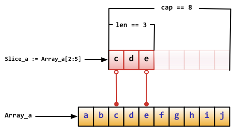

# 数据类型

## 内置类型

| name         | dart             | go         | js                   | python           |
|--------------|------------------|------------|----------------------|------------------|
| numbers      | num              |            | Number               | Numbers          |
| numbers      | int              | int        |                      | -int             |
| numbers      |                  | int8       |                      |                  |
| numbers      |                  | int16      |                      |                  |
| numbers      |                  | int32/rune |                      |                  |
| numbers      |                  | int64      |                      |                  |
| numbers      |                  | uint       |                      |                  |
| numbers      |                  | uint8/byte |                      |                  |
| numbers      |                  | uint16     |                      |                  |
| numbers      |                  | uint32     |                      |                  |
| numbers      |                  | uint64     |                      |                  |
| numbers      |                  | uintptr    |                      |                  |
| numbers      | double           | float32    |                      | -float           |
| numbers      |                  | float64    |                      |                  |
| numbers      |                  | complex64  |                      |                  |
| numbers      |                  | complex128 |                      |                  |
| complex      |                  |            |                      | complex          |
| strings      | String           | string     | String               | str              |
| booleans     | bool(true/false) | bool       | Boolean(true/false)  | bool(True/False) |
| lists/arrays | List             |            | -Array               | list             |
| maps         | map              |            | -Map                 | dict             |
| runes        | runes            |            |                      |                  |
| symbols      | symbol           |            | Symbol               |                  |
| Null         | -null            |            | Null(null)           |                  |
| Undefined    |                  |            | Undefined(undefined) |                  |
| Object       | Object           |            | Object               |                  |
| Set          | Set              |            | -Set                 | set              |
| ArrayBuffer  |                  |            | -ArrayBuffer         | bytearray        |
| Tuples       |                  |            |                      | tuple            |
| range        |                  |            |                      | range            |
| Function     | -Function        |            |                      |                  |
| dynamic      | dynamic          |            |                      |                  |
| error        |                  | error      |                      |                  |

go

int, uint 和 uintptr 在 32 位系统上通常为 32 位宽，在 64 位系统上则为 64 位宽。
当你需要一个整数值时应使用 int 类型，除非你有特殊的理由使用固定大小或无符号的整数类型。

```go
package tempconv
import "fmt"
type Celsius float64    // 摄氏温度
type Fahrenheit float64 // 华氏温度
const (
  AbsoluteZeroC Celsius = -273.15 // 绝对零度
  FreezingC     Celsius = 0       // 结冰点温度
  BoilingC      Celsius = 100     // 沸水温度
)
func CToF(c Celsius) Fahrenheit { return Fahrenheit(c*9/5 + 32) }
func FToC(f Fahrenheit) Celsius { return Celsius((f - 32) * 5 / 9) }
```

### 默认类型

dart

```dart
```

go

```go
// 在声明一个变量而不指定其类型时（即使用不带类型的 := 语法或 var = 表达式语法），
// 变量的类型由右值推导得出。
var i int
j := i // j 也是一个 int

// 不过当右边包含未指明类型的数值常量时，
// 新变量的类型就可能是 int, float64 或 complex128 了，
// 这取决于常量的精度：
i := 42           // int
f := 3.142        // float64
g := 0.867 + 0.5i // complex128
```

js

```js
```

## 类型判断

dart

```dart
// as 类型转换
// is 如果对象是指定的类型返回 True
// is! 如果对象是指定的类型返回 False

if (emp is Person) { // Type check
  emp.firstName = 'Bob';
}
// 使用 as 操作符可以简化上面的代码：
(emp as Person).firstName = 'Bob';

// 可以使用 Object 的 runtimeType 属性来判断实例 的类型，
// 该属性 返回一个 Type 对象。
var msg = 'false';
print('The type of a is ${msg.runtimeType}');

// 其他方式
import 'dart:mirrors';
getTypeName(dynamic obj) {
  return reflect(obj).type.reflectedType.toString();
}
```

go

```go
// 可以通过%T参数打印类型信息
const noDelay time.Duration = 0
const timeout = 5 * time.Minute
fmt.Printf("%T %[1]v\n", noDelay)     // "time.Duration 0"
fmt.Printf("%T %[1]v\n", timeout)     // "time.Duration 5m0s"
fmt.Printf("%T %[1]v\n", time.Minute) // "time.Duration 1m0s"

fmt.Printf("%T\n", 0)      // "int"
fmt.Printf("%T\n", 0.0)    // "float64"
fmt.Printf("%T\n", 0i)     // "complex128"
fmt.Printf("%T\n", '\000') // "int32" (rune)


var t interface{}
t = functionOfSomeType()
switch t := t.(type) {
  default:
    fmt.Printf("unexpected type %T", t)       // %T 输出 t 是什么类型
  case bool:
    fmt.Printf("boolean %t\n", t)             // t 是 bool 类型
  case int:
    fmt.Printf("integer %d\n", t)             // t 是 int 类型
  case *bool:
    fmt.Printf("pointer to boolean %t\n", *t) // t 是 *bool 类型
  case *int:
    fmt.Printf("pointer to integer %d\n", *t) // t 是 *int 类型
}


package main
import (
  "fmt"
  "strconv"
)
type Element interface{}
type List [] Element
type Person struct {
    name string
    age int
}
//定义了String方法，实现了fmt.Stringer
func (p Person) String() string {
  return "(name: " + p.name + " - age: "+strconv.Itoa(p.age)+ " years)"
}
func main() {
  list := make(List, 3)
  list[0] = 1 // an int
  list[1] = "Hello" // a string
  list[2] = Person{"Dennis", 70}
  // for index, element := range list {
  //   if value, ok := element.(int); ok {
  //     fmt.Printf("list[%d] is an int and its value is %d\n", index, value)
  //   } else if value, ok := element.(string); ok {
  //     fmt.Printf("list[%d] is a string and its value is %s\n", index, value)
  //   } else if value, ok := element.(Person); ok {
  //     fmt.Printf("list[%d] is a Person and its value is %s\n", index, value)
  //   } else {
  //     fmt.Printf("list[%d] is of a different type\n", index)
  //   }
  // }
  for index, element := range list{
    switch value := element.(type) {
      case int:
        fmt.Printf("list[%d] is an int and its value is %d\n", index, value)
      case string:
        fmt.Printf("list[%d] is a string and its value is %s\n", index, value)
      case Person:
        fmt.Printf("list[%d] is a Person and its value is %s\n", index, value)
      default:
        fmt.Println("list[%d] is of a different type", index)
    }
  }
}
```

js

```js
typeof undefined; // undefined
typeof []; // object
typeof '123'; // string
typeof null; // object

// instanceof运算符返回一个布尔值，表示对象是否为某个构造函数的实例。
const s = new String('123');
s instanceof String; // true
s instanceof Object; // true

v instanceof Vehicle
// 等同于
Vehicle.prototype.isPrototypeOf(v)


Object.prototype.toString.call(2) // "[object Number]"
Object.prototype.toString.call('') // "[object String]"
Object.prototype.toString.call(true) // "[object Boolean]"
Object.prototype.toString.call(undefined) // "[object Undefined]"
Object.prototype.toString.call(null) // "[object Null]"
Object.prototype.toString.call(Math) // "[object Math]"
Object.prototype.toString.call({}) // "[object Object]"
Object.prototype.toString.call([]) // "[object Array]"

var type = function (o){
  var s = Object.prototype.toString.call(o);
  return s.match(/\[object (.*?)\]/)[1].toLowerCase();
};
type({}); // "object"
type([]); // "array"
type(5); // "number"
type(null); // "null"
type(); // "undefined"
type(/abcd/); // "regex"
type(new Date()); // "date"

['Null',
 'Undefined',
 'Object',
 'Array',
 'String',
 'Number',
 'Boolean',
 'Function',
 'RegExp'
].forEach(function (t) {
  type['is' + t] = function (o) {
    return type(o) === t.toLowerCase();
  };
});
type.isObject({}) // true
type.isNumber(NaN) // true
type.isRegExp(/abc/) // true


function type (obj) {
  return Reflect.apply(Object.prototype.toString, obj, []).replace(/^\[object\s(\w+)\]$/, '$1').toLowerCase()
}
type(new String('123')) // string
```

python

```python
import types
type(myInt) is types.IntType
type(myInt) is type(1)
isinstance(myInt, int)
```

### 检查两个引用是否指向同一个对象

检查两个引用是否指向同一个对象(内存地址)

dart

```dart
bool identical(Object a, Object b)
```

go

```go
```

js

ES5 比较两个值是否相等，只有两个运算符：相等运算符（==）和严格相等运算符（===）。
它们都有缺点，前者会自动转换数据类型，后者的NaN不等于自身，以及+0等于-0。

```js
Object.is('foo', 'foo')
// true
Object.is({}, {})
// false
```

python

```python
```

### 自定义类型

dart

```dart
```

go

```go
type ages int
type money float32
type months map[string]int
m := months {
  "January":31,
  "February":28,
  // ...
  "December":31,
}
type Rectangle struct {
  width, height float64
}
```

js

```js
```

python

```python
```

## 基本类型

### 数值

#### 数值操作

dart

```dart
assert(int.parse('42') == 42);
assert(int.parse('0x42') == 66);
assert(double.parse('0.50') == 0.5);

assert(num.parse('42') is int);
assert(num.parse('0x42') is int);
assert(num.parse('0.50') is double);

assert(int.parse('42', radix: 16) == 66);

// Convert an int to a string.
assert(42.toString() == '42');
// Convert a double to a string.
assert(123.456.toString() == '123.456');
// Specify the number of digits after the decimal.
assert(123.456.toStringAsFixed(2) == '123.46');
// Specify the number of significant figures.
assert(123.456.toStringAsPrecision(2) == '1.2e+2');
assert(double.parse('1.2e+2') == 120.0);
```

go

```go
```

js

```js
parseInt('v8',32) // 1000

const string1 = '1'
const number1 = parseInt(string1)
// 3
console.log(number1 + 2)
```

python

```python
string_1 = "1"
number_1 = int(string_1)
# 3
print(number_1 + 2)
```

#### 计算最大值和最小值

dart

```dart
assert(math.max(1, 1000) == 1000);
assert(math.min(1, -1000) == -1000);
```

go

```go
```

js

```js
const a = [10,5,11,7,8,9];
Math.max(...a) - Math.min(...a)
```

python

```python
# 100
print(max(100, 50))
# 40
print(min(80, 40))
```

#### 数学常量

dart

```dart
import 'dart:math' as math;

print(math.E);     // 2.718281828459045
print(math.PI);    // 3.141592653589793
print(math.SQRT2); // 1.4142135623730951
```

go

```go
```

js

```js
Math.E // 2.718281828459045
Math.LN2 // 0.6931471805599453
Math.LN10 // 2.302585092994046
Math.LOG2E // 1.4426950408889634
Math.LOG10E // 0.4342944819032518
Math.PI // 3.141592653589793
Math.SQRT1_2 // 0.7071067811865476
Math.SQRT2 // 1.4142135623730951
```

python

```python
```

#### 随机数

dart

```dart
import 'dart:math' as math;

var random = new math.Random();
random.nextDouble(); // Between 0.0 and 1.0: [0, 1)
random.nextInt(10);  // Between 0 and 9.

var random = new math.Random();
random.nextBool();  // true or false
```

go

```go
```

js

```js
// Math.random()返回0到1之间的一个伪随机数，可能等于0，但是一定小于1。
Math.random() // 0.7151307314634323

// 任意范围的随机数生成函数
function getRandomArbitrary(min, max) {
  return Math.random() * (max - min) + min;
}
getRandomArbitrary(1.5, 6.5)
// 2.4942810038223864

// 任意范围的随机整数生成函数
function getRandomInt(min, max) {
  return Math.floor(Math.random() * (max - min + 1)) + min;
}
getRandomInt(1, 6) // 5

// 返回随机字符的例子
function random_str(length) {
  var ALPHABET = 'ABCDEFGHIJKLMNOPQRSTUVWXYZ';
  ALPHABET += 'abcdefghijklmnopqrstuvwxyz';
  ALPHABET += '0123456789-_';
  var str = '';
  for (var i=0; i < length; ++i) {
    var rand = Math.floor(Math.random() * ALPHABET.length);
    str += ALPHABET.substring(rand, rand + 1);
  }
  return str;
}
random_str(6) // "NdQKOr"

// 返回随机字符另一个实现
const str = 'abcdefghijklmnopqrstuvwxyz9876543210';
const l = 6;
// [...Array(l)].map(()=>str.charAt(Math.floor(Math.random() * str.length))).join('');
[...Array(l)].map(()=>str[~~(Math.random() * str.length)]).join('');
```

python

```sh
>>> import random
>>> random.choice(['apple', 'pear', 'banana'])
'apple'
>>> random.sample(range(100), 10)   # sampling without replacement
[30, 83, 16, 4, 8, 81, 41, 50, 18, 33]
>>> random.random()    # random float
0.17970987693706186
>>> random.randrange(6)    # random integer chosen from range(6)
4

# statistics 模块计算数值数据的基本统计属性（均值，中位数，方差等）:
>>> import statistics
>>> data = [2.75, 1.75, 1.25, 0.25, 0.5, 1.25, 3.5]
>>> statistics.mean(data)
1.6071428571428572
>>> statistics.median(data)
1.25
>>> statistics.variance(data)
1.3720238095238095
```

##### 生成随机整数

dart

```dart
import 'dart:math' as math;
var random = new math.Random();
random.nextInt(10);  // Between 0 and 9.
```

go

```go
```

js

```js
// 任意范围的随机整数生成函数
function getRandomInt(min, max) {
  return Math.floor(Math.random() * (max - min + 1)) + min;
}
getRandomInt(1, 6) // 5
```

python

```sh
>>> import random
>>> random.randrange(6)    # random integer chosen from range(6)
4
```

##### 生成随机布尔值

dart

```dart
import 'dart:math' as math;

var random = new math.Random();
random.nextBool();  // true or false
```

go

```go
```

js

```js
```

python

```python
```

##### 生成随机字符串

dart

```dart
```

go

```go
```

js

```js
// 返回随机字符的例子
function random_str(length) {
  var ALPHABET = 'ABCDEFGHIJKLMNOPQRSTUVWXYZ';
  ALPHABET += 'abcdefghijklmnopqrstuvwxyz';
  ALPHABET += '0123456789-_';
  var str = '';
  for (var i=0; i < length; ++i) {
    var rand = Math.floor(Math.random() * ALPHABET.length);
    str += ALPHABET.substring(rand, rand + 1);
  }
  return str;
}
random_str(6) // "NdQKOr"

// 返回随机字符另一个实现
const str = 'abcdefghijklmnopqrstuvwxyz9876543210';
const l = 6;
// [...Array(l)].map(()=>str.charAt(Math.floor(Math.random() * str.length))).join('');
[...Array(l)].map(()=>str[~~(Math.random() * str.length)]).join('');
```

python

```sh
```

##### 随机选择子对象

dart

```dart
```

go

```go
```

js

```js
```

python

```sh
>>> import random
>>> random.choice(['apple', 'pear', 'banana'])
'apple'
```

#### 三角函数

dart

```dart
import 'dart:math' as math;

// Cosine
assert(math.cos(math.PI) == -1.0);

// Sine
var degrees = 30;
var radians = degrees * (math.PI / 180);
// radians is now 0.52359.
var sinOf30degrees = math.sin(radians);
// sin 30° = 0.5
assert((sinOf30degrees - 0.5).abs() < 0.01);
```

go

```go
```

js

```js
Math.sin(0) // 0
Math.cos(0) // 1
Math.tan(0) // 0

Math.sin(Math.PI / 2) // 1

Math.asin(1) // 1.5707963267948966
Math.acos(1) // 0
Math.atan(1) // 0.7853981633974483
```

python

```python
```

#### 十进制浮点运算

dart

```dart
```

go

```go
```

js

```js
// 小数点截取
(10).toFixed(2) // "10.00"
10.005.toFixed(2) // "10.01"

// 2
console.log(Math.ceil(1.5))
// 1
console.log(Math.floor(1.5))
// 2
console.log(Math.round(1.5))
```

python

```python
import math

# 2
print(math.ceil(1.5))
# 1
print(math.floor(1.5))
# 2
print(round(1.5))
```

#### 进制转换

dart

```dart
```

go

```go
```

js

```js
// 10进制转为32进制
(1000).toString(32) // 'v8'
// 32进制转为10进制
parseInt('v8',32) // 1000
```

python

```python
```

### 字符串

dart

Dart 字符串是 UTF-16 编码的字符序列。
可以使用单引号或者双引号来创建字符串：

```dart
var s1 = 'Single quotes work well for string literals.';
var s2 = "Double quotes work just as well.";
var s3 = 'It\'s easy to escape the string delimiter.';
var s4 = "It's even easier to use the other delimiter.";
```

go

Go中的字符串都是采用UTF-8字符集编码。
字符串是用一对双引号（""）或反引号（`` ）括起来定义

```go
var frenchHello string  // 声明变量为字符串的一般方法
var emptyString string = ""  // 声明了一个字符串变量，初始化为空字符串
func test() {
  no, yes, maybe := "no", "yes", "maybe"  // 简短声明，同时声明多个变量
  japaneseHello := "Konichiwa"  // 同上
  frenchHello = "Bonjour"  // 常规赋值
}


// Go中字符串是不可变的
var s string = "hello"
s[0] = 'c' // 出错！！！！

s := "hello"
c := []byte(s)  // 将字符串 s 转换为 []byte 类型
c[0] = 'c'
s2 := string(c)  // 再转换回 string 类型
fmt.Printf("%s\n", s2)
```

js

```js
const someString = 'abcd'
// 4
console.log(someString.length)
```

python

```python
some_string = "abcd"
# 4
print(len(some_string))

'spam eggs'  # single quotes
'doesn\'t'  # use \' to escape the single quote...
"doesn't"  # ...or use double quotes instead
'"Yes," they said.'
"\"Yes,\" they said."
'"Isn\'t," they said.'

print('C:\some\name')  # here \n means newline!
print(r'C:\some\name')  # note the r before the quote

# 字符串可以用 + 进行连接（粘到一起），也可以用 * 进行重复:
# 3 times 'un', followed by 'ium'
3 * 'un' + 'ium'

# 相邻的两个或多个 字符串字面值 （引号引起来的字符）将会自动连接到一起.
'Py' 'thon'
```

```sh
# 字符串是可以被 索引 （下标访问）的，第一个字符索引是 0。
>>> word = 'Python'
>>> word[0]  # character in position 0
'P'
>>> word[5]  # character in position 5
'n'

# 索引也可以用负数，这种会从右边开始数:
>>> word[-1]  # last character
'n'
>>> word[-2]  # second-last character
'o'
>>> word[-6]
'P'

# 除了索引，字符串还支持 切片。
>>> word[0:2]  # characters from position 0 (included) to 2 (excluded)
'Py'
>>> word[2:5]  # characters from position 2 (included) to 5 (excluded)
'tho'
>>> word[:2] + word[2:]
'Python'
>>> word[:4] + word[4:]
'Python'
```

#### 多行字符串

dart

使用三个单引号或者双引号也可以 创建多行字符串对象：

```dart
var s1 = '''
You can create
multi-line strings like this one.
''';

var s2 = """This is also a
multi-line string.""";
```

go

`` 括起的字符串为Raw字符串，即字符串在代码中的形式就是打印时的形式，
它没有字符转义，换行也将原样输出

```go
m := `hello
  world`
```

js

```js
const x = `------
Line 1
Line 2
Line 3
------`
```

python

```python
x = """------
Line 1
Line 2
Line 3
------"""

print("""\
Usage: thingy [OPTIONS]
     -h                        Display this usage message
     -H hostname               Hostname to connect to
""")

text = ('Put several strings within parentheses '
        'to have them joined together.')
```

#### 字符串前缀

##### 原始字符串

dart

```dart
var s = r"In a raw string, even \n isn't special.";
```

go

```go
```

js

```js
```

python

```python
print(r'C:\some\name')  # note the r before the quote
```

#### 字符串搜索

dart

```dart
// Check whether a string contains another string.
assert('Never odd or even'.contains('odd'));

// Does a string start with another string?
assert('Never odd or even'.startsWith('Never'));

// Does a string end with another string?
assert('Never odd or even'.endsWith('even'));

// Find the location of a string inside a string.
assert('Never odd or even'.indexOf('odd') == 6);
```

go

```go
```

js

```js
let s = 'Hello world!';
s.startsWith('Hello') // true
s.endsWith('!') // true
s.includes('o') // true

let s = 'Hello world!';
s.startsWith('world', 6) // true
s.endsWith('Hello', 5) // true
s.includes('Hello', 6) // false

'hello world'.indexOf('o') // 4
'JavaScript'.indexOf('script') // -1
'hello world'.indexOf('o', 6) // 7

'hello world'.lastIndexOf('o') // 7
'hello world'.lastIndexOf('o', 6) // 4

'cat, bat, sat, fat'.search('at') // 1
// replace方法用于替换匹配的子字符串，一般情况下只替换第一个匹配（除非使用带有g修饰符的正则表达式）。
'aaa'.replace('a', 'b') // "baa"

// 2 is in the string
if ('123'.includes('2')) {
  console.log('2 is in the string')
}

// 2 is not in the string
if (!'456'.includes('2')) {
  console.log('2 is not in the string')
}

// Has a number
if ('iphone 8'.match(/\d/g)) {
  console.log('Has a number')
}

// Doesn't have a number
if (!'iphone x'.match(/\d/g)) {
  console.log("Doesn't have a number")
}
```

python

```python
# 2 is in the string
if "2" in "123":
    print("2 is in the string")

# 2 is not in the string
if "2" not in "456":
    print("2 is not in the string")


import re

# Has a number
if re.search(r"\d", "iphone 8"):
    print("Has a number")

# Doesn't have a number
if not re.search(r"\d", "iphone x"):
    print("Doesn't have a number")
```

#### 字符串截取

dart

```dart
// Grab a substring.
assert('Never odd or even'.substring(6, 9) == 'odd');

// Split a string using a string pattern.
var parts = 'structured web apps'.split(' ');
assert(parts.length == 3);
assert(parts[0] == 'structured');

// Get a UTF-16 code unit (as a string) by index.
assert('Never odd or even'[0] == 'N');

// Use split() with an empty string parameter to get
// a list of all characters (as Strings); good for
// iterating.
for (var char in 'hello'.split('')) {
  print(char);
}

// Get all the UTF-16 code units in the string.
var codeUnitList = 'Never odd or even'.codeUnits.toList();
assert(codeUnitList[0] == 78);
```

go

```go
```

js

```js
'a|b|c'.split('|') // ["a", "b", "c"]
'a||c'.split('|') // ['a', '', 'c']

// slice方法用于从原字符串取出子字符串并返回，不改变原字符串。
// 它的第一个参数是子字符串的开始位置，第二个参数是子字符串的结束位置（不含该位置）。

// substring方法跟slice方法很相像
// 不建议使用substring方法，应该优先使用slice
'JavaScript'.slice(0, 4) // "Java"
'JavaScript'.slice(-6) // "Script"
'JavaScript'.slice(0, -6) // "Java"
'JavaScript'.slice(-2, -1) // "p"

// substr方法的第一个参数是子字符串的开始位置（从0开始计算），第二个参数是子字符串的长度。
// 如果省略第二个参数，则表示子字符串一直到原字符串的结束。
// 如果第一个参数是负数，表示倒数计算的字符位置。
// 如果第二个参数是负数，将被自动转为0，因此会返回空字符串。
'JavaScript'.substr(4, 6) // "Script"
'JavaScript'.substr(-6) // "Script"
'JavaScript'.substr(4, -1) // ""

const someString = '0123456'
// 234
console.log(someString.substring(2, 5))


const someString = 'a,b,c'
const someStringSplit = someString.split(',')
// a
console.log(someStringSplit[0])
// b
console.log(someStringSplit[1])
// c
console.log(someStringSplit[2])
```

python

```python
some_string = "0123456"
# 234
print(some_string[2:5])


some_string = "a,b,c"
some_string_split = some_string.split(",")
# a
print(some_string_split[0])
# b
print(some_string_split[1])
# c
print(some_string_split[2])
```

#### 大小写转换

dart

```dart
// Convert to uppercase.
assert('structured web apps'.toUpperCase() == 'STRUCTURED WEB APPS');

// Convert to lowercase.
assert('STRUCTURED WEB APPS'.toLowerCase() == 'structured web apps');
```

go

```go
```

js

```js
'Hello World'.toLowerCase()
// "hello world"

'Hello World'.toUpperCase()
// "HELLO WORLD"
```

python

```python
# 返回原字符串的副本，其中大写字符转换为小写，小写转为大写
# 请注意 s.swapcase().swapcase() == s 并不一定为真值。
str.swapcase()
# 返回原字符串的副本，其中所有区分大小写的字符 [4] 均转换为大写
str.upper()
# 返回原字符串的副本，其所有区分大小写的字符 [4] 均转换为小写
str.lower()
```

#### 裁剪和判断空字符串

dart

```dart
// Trim a string.
assert('  hello  '.trim() == 'hello');

// Check whether a string is empty.
assert(''.isEmpty);

// Strings with only white space are not empty.
assert(!'  '.isEmpty);
```

go

```go
```

js

```js
'  hello world  '.trim()
// "hello world"

const s = '  abc  ';
s.trim() // "abc"
s.trimStart() // "abc  "
s.trimEnd() // "  abc"
```

python

```python
some_string = "   abc   "
# abc
print(some_string.strip())
```

#### 替换部分字符

dart

```dart
var greetingTemplate = 'Hello, NAME!';
var greeting = greetingTemplate
    .replaceAll(new RegExp('NAME'), 'Bob');

assert(greeting !=
    greetingTemplate); // greetingTemplate didn't change.
```

go

```go
```

js

```js
// replace方法用于替换匹配的子字符串，一般情况下只替换第一个匹配（除非使用带有g修饰符的正则表达式）。
'aaa'.replace('a', 'b') // "baa"


const someString = 'a b c d e'
// Only changes the first space
// a,b c d e
// console.log(someString.replace(' ', ','))

// Use / /g instead of ' ' to change every space
console.log(someString.replace(/ /g, ','))
```

python

```python
some_string = "a b c d e"
# a,b,c,d,e
print(some_string.replace(" ", ","))
```

#### 格式化输出

dart

```dart
```

go

```sh
%d          十进制整数
%x, %o, %b  十六进制，八进制，二进制整数。
%f, %g, %e  浮点数： 3.141593 3.141592653589793 3.141593e+00
%t          布尔：true或false
%c          字符（rune） (Unicode码点)
%s          字符串
%q          带双引号的字符串"abc"或带单引号的字符'c'
%v          变量的自然形式（natural format）
%T          变量的类型
%%          字面上的百分号标志（无操作数）
```

```go
fmt.Printf("%d\t%s\n", n, line)
```

js

```js
const x = 'Hello'
// Hello World
console.log(`${x} World`)
```

python

```python
x = "Hello"
# Hello World
print(f"{x} World")
```

```sh
>>> year = 2016
>>> event = 'Referendum'
>>> f'Results of the {year} {event}'
'Results of the 2016 Referendum'

>>> yes_votes = 42_572_654
>>> no_votes = 43_132_495
>>> percentage = yes_votes / (yes_votes + no_votes)
>>> '{:-9} YES votes  {:2.2%}'.format(yes_votes, percentage)
' 42572654 YES votes  49.67%'

# 当你不需要花哨的输出而只是想快速显示某些变量以进行调试时，
# 可以使用 repr() or str() 函数将任何值转化为字符串。
>>> s = 'Hello, world.'
>>> str(s)
'Hello, world.'
>>> repr(s)
"'Hello, world.'"
>>> str(1/7)
'0.14285714285714285'
>>> x = 10 * 3.25
>>> y = 200 * 200
>>> s = 'The value of x is ' + repr(x) + ', and y is ' + repr(y) + '...'
>>> print(s)
The value of x is 32.5, and y is 40000...
>>> # The repr() of a string adds string quotes and backslashes:
... hello = 'hello, world\n'
>>> hellos = repr(hello)
>>> print(hellos)
'hello, world\n'
>>> # The argument to repr() may be any Python object:
... repr((x, y, ('spam', 'eggs')))
"(32.5, 40000, ('spam', 'eggs'))"

# 将pi舍入到小数点后三位:
>>> import math
>>> print(f'The value of pi is approximately {math.pi:.3f}.')
The value of pi is approximately 3.142.

# 在 ':' 后传递一个整数可以让该字段成为最小字符宽度。这在使列对齐时很有用。
>>> table = {'Sjoerd': 4127, 'Jack': 4098, 'Dcab': 7678}
>>> for name, phone in table.items():
...     print(f'{name:10} ==> {phone:10d}')
...
Sjoerd     ==>       4127
Jack       ==>       4098
Dcab       ==>       7678

# 其他的修饰符可用于在格式化之前转化值。
# '!a' 应用 ascii() ，'!s' 应用 str()，还有 '!r' 应用 repr():
>>> animals = 'eels'
>>> print(f'My hovercraft is full of {animals}.')
My hovercraft is full of eels.
>>> print(f'My hovercraft is full of {animals!r}.')
My hovercraft is full of 'eels'.

# 字符串的 format() 方法
>>> print('We are the {} who say "{}!"'.format('knights', 'Ni'))
We are the knights who say "Ni!"

>>> print('{0} and {1}'.format('spam', 'eggs'))
spam and eggs
>>> print('{1} and {0}'.format('spam', 'eggs'))
eggs and spam

>>> print('This {food} is {adjective}.'.format(
...       food='spam', adjective='absolutely horrible'))
This spam is absolutely horrible.

>>> print('The story of {0}, {1}, and {other}.'.format('Bill', 'Manfred',
                                                       other='Georg'))
The story of Bill, Manfred, and Georg.

>>> for x in range(1, 11):
...     print('{0:2d} {1:3d} {2:4d}'.format(x, x*x, x*x*x))
...
 1   1    1
 2   4    8
 3   9   27
 4  16   64
 5  25  125
 6  36  216
 7  49  343
 8  64  512
 9  81  729
10 100 1000

# str.zfill() ，它会在数字字符串的左边填充零。它能识别正负号:
>>> '12'.zfill(5)
'00012'
>>> '-3.14'.zfill(7)
'-003.14'
>>> '3.14159265359'.zfill(5)
'3.14159265359'

# 旧的字符串格式化方法
>>> import math
>>> print('The value of pi is approximately %5.3f.' % math.pi)
The value of pi is approximately 3.142.

>>> import reprlib
>>> reprlib.repr(set('supercalifragilisticexpialidocious'))
"{'a', 'c', 'd', 'e', 'f', 'g', ...}"

>>> import pprint
>>> t = [[[['black', 'cyan'], 'white', ['green', 'red']], [['magenta',
...     'yellow'], 'blue']]]
...
>>> pprint.pprint(t, width=30)
[[[['black', 'cyan'],
   'white',
   ['green', 'red']],
  [['magenta', 'yellow'],
   'blue']]]

>>> import textwrap
>>> doc = """The wrap() method is just like fill() except that it returns
... a list of strings instead of one big string with newlines to separate
... the wrapped lines."""
...
>>> print(textwrap.fill(doc, width=40))
The wrap() method is just like fill()
except that it returns a list of strings
instead of one big string with newlines
to separate the wrapped lines.
```

### Symbols

dart

mirror 系统使用 Symbol 类对象 来表达定义的 Dart 标识符名字。
Symbols 在混淆后的代码也可以 使用。

如果在写代码的时候，已经知道 symbol 的名字了，则可以使用 #符号名字 的方式直接使用。
直接使用的 symbol 对象是编译时常量，多次定义引用的是同一个对象。
如果名字不知道，则可以通过 Symbol 构造函数来 创建

```dart
import 'dart:mirrors';

// If the symbol name is known at compile time.
const className = #MyClass;

// If the symbol name is dynamically determined.
var userInput = askUserForNameOfFunction();
var functionName = new Symbol(userInput);

// 要获取原来的 symbol 名字，使用 MirrorSystem.getName() 函数。
import 'dart:mirrors';
const className = #MyClass;
assert('MyClass' == MirrorSystem.getName(className));
```

go

```go
```

js

ES6 引入了一种新的原始数据类型Symbol，表示独一无二的值。
它是 JavaScript 语言的第七种数据类型，
前六种是：undefined、null、布尔值（Boolean）、字符串（String）、数值（Number）、对象（Object）。

除了定义自己使用的 Symbol 值以外，ES6 还提供了 11 个内置的 Symbol 值，指向语言内部使用的方法。

```js
let s = Symbol();
typeof s
// "symbol"

let s1 = Symbol('foo');
let s2 = Symbol('bar');
s1 // Symbol(foo)
s2 // Symbol(bar)
s1.toString() // "Symbol(foo)"
s2.toString() // "Symbol(bar)"

// 没有参数的情况
let s1 = Symbol();
let s2 = Symbol();
s1 === s2 // false

// 有参数的情况
let s1 = Symbol('foo');
let s2 = Symbol('foo');
s1 === s2 // false

const mySymbol = Symbol();
const a = {};
a.mySymbol = 'Hello!';
a[mySymbol] // undefined
a['mySymbol'] // "Hello!"

let s1 = Symbol.for('foo');
let s2 = Symbol.for('foo');
s1 === s2 // true
```

python

```python
```

### 其他基本类型

#### null

#### undefined

## 复杂类型

### 列表

list/array列表/数组定义及操作

dart

```dart
var l = [1, 2, 3];

// 在 list 字面量之前添加 const 关键字，
// 可以 定义一个不变的 list 对象（编译时常量）
var constantList = const [1, 2, 3];
var names = <String>['Seth', 'Kathy', 'Lars'];

// Use a List constructor.
var vegetables = new List();

// Or simply use a list literal.
var fruits = ['apples', 'oranges'];

// Add to a list.
fruits.add('kiwis');

// Add multiple items to a list.
fruits.addAll(['grapes', 'bananas']);

// Get the list length.
assert(fruits.length == 5);

// Remove a single item.
var appleIndex = fruits.indexOf('apples');
fruits.removeAt(appleIndex);
assert(fruits.length == 4);

// Remove all elements from a list.
fruits.clear();
assert(fruits.length == 0);

// 使用 indexOf() 来查找 list 中对象的索引
var fruits = ['apples', 'oranges'];
// Access a list item by index.
assert(fruits[0] == 'apples');
// Find an item in a list.
assert(fruits.indexOf('apples') == 0);

// 排序
var fruits = ['bananas', 'apples', 'oranges'];
// Sort a list.
fruits.sort((a, b) => a.compareTo(b));
assert(fruits[0] == 'apples');

// 可以使用 map().toList() 或者 map().toSet() 来 强制立刻执行 map 的方法：
var loudTeaList = teas
    .map((tea) => tea.toUpperCase())
    .toList();
```

go

类型 [n]T 表示拥有 n 个 T 类型的值的数组。
数组的长度是其类型的一部分，因此数组不能改变大小。

表达式: `var a [10]int`，
会将变量 a 声明为拥有 10 个整数的数组。

```go
package main
import "fmt"
func main() {
  var a [2]string
  a[0] = "Hello"
  a[1] = "World"
  fmt.Println(a[0], a[1])
  fmt.Println(a)
  primes := [6]int{2, 3, 5, 7, 11}
  fmt.Println(primes)
}
// Hello World
// [Hello World]
// [2 3 5 7 11 0]


// 如果在数组的长度位置出现的是“...”省略号，
// 则表示数组的长度是根据初始化值的个数来计算。
q := [...]int{1, 2, 3}
fmt.Printf("%T\n", q) // "[3]int"

// 数组的长度是数组类型的一个组成部分，
// 因此[3]int和[4]int是两种不同的数组类型。
q := [3]int{1, 2, 3}
q = [4]int{1, 2, 3, 4} // 编译错误: 不能赋值 [4]int 给 [3]int


// 指定一个索引和对应值列表的方式初始化
type Currency int
const (
  USD Currency = iota // 美元
  EUR                 // 欧元
  GBP                 // 英镑
  RMB                 // 人民币
)
symbol := [...]string{USD: "$", EUR: "€", GBP: "￡", RMB: "￥"}
fmt.Println(RMB, symbol[RMB]) // "3 ￥"

// 定义了一个含有100个元素的数组r，最后一个元素被初始化为-1，其它元素都是用0初始化。
r := [...]int{99: -1}


// 如果一个数组的元素类型是可以相互比较的，那么数组类型也是可以相互比较的，
// 只有当两个数组的所有元素都是相等的时候数组才是相等的。
a := [2]int{1, 2}
b := [...]int{1, 2}
c := [2]int{1, 3}
fmt.Println(a == b, a == c, b == c) // "true false false"
d := [3]int{1, 2}
fmt.Println(a == d) // compile error: cannot compare [2]int == [3]int

// 消息摘要有256bit大小，因此对应[32]byte数组类型。
import "crypto/sha256"
func main() {
    c1 := sha256.Sum256([]byte("x"))
    c2 := sha256.Sum256([]byte("X"))
    fmt.Printf("%x\n%x\n%t\n%T\n", c1, c2, c1 == c2, c1)
    // Output:
    // 2d711642b726b04401627ca9fbac32f5c8530fb1903cc4db02258717921a4881
    // 4b68ab3847feda7d6c62c1fbcbeebfa35eab7351ed5e78f4ddadea5df64b8015
    // false
    // [32]uint8
}


// 下面的函数用于给[32]byte类型的数组清零：
func zero(ptr *[32]byte) {
  for i := range ptr {
    ptr[i] = 0
  }
}
// 其实数组字面值[32]byte{}就可以生成一个32字节的数组。
// 将上面的zero函数写的更简洁一点：
func zero(ptr *[32]byte) {
  *ptr = [32]byte{}
}
```

js

```js
let l = [1, 2, 3];

var arr = [1, 2, 3];
typeof arr // "object"
Array.isArray(arr) // true

var arr = [1, 2, 3];
arr.valueOf() // [1, 2, 3]

var arr = [1, 2, 3];
arr.toString() // "1,2,3"
var arr = [1, 2, 3, [4, 5, 6]];
arr.toString() // "1,2,3,4,5,6"

var arr = [];
arr.push(1, 2);
arr.push(3);
arr.pop();
arr // [1, 2]

var a = ['a', 'b', 'c'];
a.shift() // 'a'
a // ['b', 'c']

var a = ['a', 'b', 'c'];
a.unshift('x'); // 4
a // ['x', 'a', 'b', 'c']

var a = [1, 2, 3, 4];
a.join(' ') // '1 2 3 4'
a.join(' | ') // "1 | 2 | 3 | 4"
a.join() // "1,2,3,4"

['hello'].concat(['world'])
// ["hello", "world"]
['hello'].concat(['world'], ['!'])
// ["hello", "world", "!"]
[1, 2, 3].concat(4, 5, 6)
// [1, 2, 3, 4, 5, 6]

var a = ['a', 'b', 'c'];
a.reverse() // ["c", "b", "a"]
a // ["c", "b", "a"]

// arr.slice(start, end);
var a = ['a', 'b', 'c'];
a.slice(0) // ["a", "b", "c"]
a.slice(1) // ["b", "c"]
a.slice(1, 2) // ["b"]
a.slice(2, 6) // ["c"]
a.slice() // ["a", "b", "c"]

var a = ['a', 'b', 'c'];
a.slice(-2) // ["b", "c"]
a.slice(-2, -1) // ["b"]

var a = ['a', 'b', 'c'];
a.slice(4) // []
a.slice(2, 1) // []

// arr.splice(start, count, addElement1, addElement2, ...);
var a = ['a', 'b', 'c', 'd', 'e', 'f'];
a.splice(4, 2) // ["e", "f"]
a // ["a", "b", "c", "d"]

// sort方法对数组成员进行排序，默认是按照字典顺序排序
// 排序后，原数组将被改变。
['d', 'c', 'b', 'a'].sort()
// ['a', 'b', 'c', 'd']
[11, 101].sort()
// [101, 11]

[10111, 1101, 111].sort(function (a, b) {
  return a - b;
})
// [111, 1101, 10111]

[
  { name: "张三", age: 30 },
  { name: "李四", age: 24 },
  { name: "王五", age: 28  }
].sort(function (o1, o2) {
  return o1.age - o2.age;
})
// [
//   { name: "李四", age: 24 },
//   { name: "王五", age: 28  },
//   { name: "张三", age: 30 }
// ]

var a = ['a', 'b', 'c'];
a.indexOf('b') // 1
a.indexOf('y') // -1

var users = [
  {name: 'tom', email: 'tom@example.com'},
  {name: 'peter', email: 'peter@example.com'}
];
users
  .map(function (user) {
    return user.email;
  })
  .filter(function (email) {
    return /^t/.test(email);
  })
  .forEach(function (email) {
    console.log(email);
  });
// "tom@example.com"

const someList = ['a', 'b', 'c']
// a,b,c
console.log(someList.join(','))


const someList = [6, 3, 5]
console.log(someList.length)
// 6
// 3
// 5
someList.forEach(element => {
  console.log(element)
})

// 2 is in the list
if ([1, 2, 3].includes(2)) {
  console.log('2 is in the list')
}

// 2 is not in the list
if (![4, 5, 6].includes(2)) {
  console.log('2 is not in the list')
}

const someList = [1, 2, 3, 4]
someList.reverse()

// 4
// 3
// 2
// 1
someList.forEach(element => {
  console.log(element)
})


const someList = [1]
someList.push(...[2, 3])
// 1
// 2
// 3
someList.forEach(element => {
  console.log(element)
})


const originalList = [1]
const newList = originalList.concat([2, 3])
originalList[0] = 5
// 1
// 2
// 3
newList.forEach(element => {
  console.log(element)
})


const someList = [4, 5]
someList.unshift(3)
// 3
// 4
// 5
someList.forEach(element => {
  console.log(element)
})


const someList = ['a', 'b', 'c']
someList.splice(1, 1)
// a
// c
someList.forEach(element => {
  console.log(element)
})


const someList = [1, 2, 3, 4]
// 4
console.log(someList.pop())
// 1
console.log(someList.shift())
// 2
// 3
someList.forEach(element => {
  console.log(element)
})


const someList = ['a', 'b', 'c', 'd', 'e']
// 2
console.log(someList.indexOf('c'))


const originalList = [1, 2, 3]
const newList = [...originalList]
originalList[2] = 4

// 1
// 2
// 3
newList.forEach(element => {
  console.log(element)
})


const someList = [1, 2, 3]
const reducer = (accumulator, currentValue) => accumulator + currentValue
// 6
console.log(someList.reduce(reducer))
```

python

```python
some_list = ["a", "b", "c"]
# a,b,c
print(",".join(some_list))

some_list = [6, 3, 5]
print(len(some_list))
# 6
# 3
# 5
for item in some_list:
    print(item)

# 2 is in the list
if 2 in [1, 2, 3]:
    print("2 is in the list")

# 2 is not in the list
if 2 not in [4, 5, 6]:
    print("2 is not in the list")

some_list = [1, 2, 3, 4]
# reversed(some_list) is just an iterable.
# To convert an iterable into a list, use list()
reversed_list = list(reversed(some_list))
# 4
# 3
# 2
# 1
for item in reversed_list:
    print(item)
# You can use an iterable instead of a list in a for loop
# for item in reversed(some_list):


some_list = [1]
some_list.extend([2, 3])

# 1
# 2
# 3
for x in some_list:
    print(x)


original_list = [1]
new_list = original_list + [2, 3]
original_list[0] = 5
# 1
# 2
# 3
for x in new_list:
    print(x)


some_list = [4, 5]
some_list.insert(0, 3)
# 3
# 4
# 5
for x in some_list:
    print(x)


some_list = ["a", "b", "c"]
del some_list[1]
# a
# c
for x in some_list:
    print(x)


some_list = [1, 2, 3, 4]
# 4
print(some_list.pop())
# 1
print(some_list.pop(0))
# 2
# 3
for x in some_list:
    print(x)


some_list = ["a", "b", "c", "d", "e"]
# 2
print(some_list.index("c"))


original_list = [1, 2, 3]
new_list = original_list[:]  # or original_list.copy()
original_list[2] = 4
# 1
# 2
# 3
for x in new_list:
    print(x)


some_list = [1, 2, 3]
# 6
print(sum(some_list))
```

```sh
>>> squares = [1, 4, 9, 16, 25]
>>> squares
[1, 4, 9, 16, 25]

# 列表也支持索引和切片:
>>> squares[0]  # indexing returns the item
1
>>> squares[-1]
25
>>> squares[-3:]  # slicing returns a new list
[9, 16, 25]

# 切片会返回列表的一个新的(浅)拷贝:
>>> squares[:]
[1, 4, 9, 16, 25]

# 列表同样支持拼接操作:
>>> squares + [36, 49, 64, 81, 100]
[1, 4, 9, 16, 25, 36, 49, 64, 81, 100]

# 与 immutable 的字符串不同, 列表是一个 mutable 类型，
# 就是说，它自己的内容可以改变:
>>> cubes = [1, 8, 27, 65, 125]  # something's wrong here
>>> 4 ** 3  # the cube of 4 is 64, not 65!
64
>>> cubes[3] = 64  # replace the wrong value
>>> cubes
[1, 8, 27, 64, 125]

# 通过 append() 方法 添加新元素
>>> cubes.append(216)  # add the cube of 6
>>> cubes.append(7 ** 3)  # and the cube of 7
>>> cubes
[1, 8, 27, 64, 125, 216, 343]

# 给切片赋值也是可以的，这样甚至可以改变列表大小，或者把列表整个清空:
>>> letters = ['a', 'b', 'c', 'd', 'e', 'f', 'g']
>>> letters
['a', 'b', 'c', 'd', 'e', 'f', 'g']
>>> # replace some values
>>> letters[2:5] = ['C', 'D', 'E']
>>> letters
['a', 'b', 'C', 'D', 'E', 'f', 'g']
>>> # now remove them
>>> letters[2:5] = []
>>> letters
['a', 'b', 'f', 'g']
>>> # clear the list by replacing all the elements with an empty list
>>> letters[:] = []
>>> letters
[]

# 内置函数 len() 也可以作用到列表上:
>>> letters = ['a', 'b', 'c', 'd']
>>> len(letters)
4

# 也可以嵌套列表 (创建包含其他列表的列表), 比如说:
>>> a = ['a', 'b', 'c']
>>> n = [1, 2, 3]
>>> x = [a, n]
>>> x
[['a', 'b', 'c'], [1, 2, 3]]
>>> x[0]
['a', 'b', 'c']
>>> x[0][1]
'b'
```

```sh
# insert ，remove 或者 sort 方法，只修改列表，没有打印出返回值
>>> fruits = ['orange', 'apple', 'pear', 'banana', 'kiwi', 'apple', 'banana']
>>> fruits.count('apple')
2
>>> fruits.count('tangerine')
0
>>> fruits.index('banana')
3
>>> fruits.index('banana', 4)  # Find next banana starting a position 4
6
>>> fruits.reverse()
>>> fruits
['banana', 'apple', 'kiwi', 'banana', 'pear', 'apple', 'orange']
>>> fruits.append('grape')
>>> fruits
['banana', 'apple', 'kiwi', 'banana', 'pear', 'apple', 'orange', 'grape']
>>> fruits.sort()
>>> fruits
['apple', 'apple', 'banana', 'banana', 'grape', 'kiwi', 'orange', 'pear']
>>> fruits.pop()
'pear'

# 列表作为栈使用
>>> stack = [3, 4, 5]
>>> stack.append(6)
>>> stack.append(7)
>>> stack
[3, 4, 5, 6, 7]
>>> stack.pop()
7
>>> stack
[3, 4, 5, 6]
>>> stack.pop()
6
>>> stack.pop()
5
>>> stack
[3, 4]

# 列表作为队列使用
>>> from collections import deque
>>> queue = deque(["Eric", "John", "Michael"])
>>> queue.append("Terry")           # Terry arrives
>>> queue.append("Graham")          # Graham arrives
>>> queue.popleft()                 # The first to arrive now leaves
'Eric'
>>> queue.popleft()                 # The second to arrive now leaves
'John'
>>> queue                           # Remaining queue in order of arrival
deque(['Michael', 'Terry', 'Graham'])

# del语句
>>> a = [-1, 1, 66.25, 333, 333, 1234.5]
>>> del a[0]
>>> a
[1, 66.25, 333, 333, 1234.5]
>>> del a[2:4]
>>> a
[1, 66.25, 1234.5]
>>> del a[:]
>>> a
[]

# del 也可以被用来删除整个变量
>>> del a
```

#### 列表查找

dart

```dart
// 使用 indexOf() 来查找 list 中对象的索引
var fruits = ['apples', 'oranges'];
// Access a list item by index.
assert(fruits[0] == 'apples');
// Find an item in a list.
assert(fruits.indexOf('apples') == 0);
```

go

```go
```

js

```js
var a = ['a', 'b', 'c'];
a.indexOf('b') // 1
a.indexOf('y') // -1

// 2 is in the list
if ([1, 2, 3].includes(2)) {
  console.log('2 is in the list')
}

// 2 is not in the list
if (![4, 5, 6].includes(2)) {
  console.log('2 is not in the list')
}


const someList = ['a', 'b', 'c', 'd', 'e']
// 2
console.log(someList.indexOf('c'))


const originalList = [1, 2, 3]
const newList = [...originalList]
originalList[2] = 4

```

python

```python
# 2 is in the list
if 2 in [1, 2, 3]:
    print("2 is in the list")

# 2 is not in the list
if 2 not in [4, 5, 6]:
    print("2 is not in the list")


some_list = ["a", "b", "c", "d", "e"]
# 2
print(some_list.index("c"))
```

```sh
>>> squares = [1, 4, 9, 16, 25]
>>> squares
[1, 4, 9, 16, 25]

# 列表也支持索引和切片:
>>> squares[0]  # indexing returns the item
1

# insert ，remove 或者 sort 方法，只修改列表，没有打印出返回值
>>> fruits = ['orange', 'apple', 'pear', 'banana', 'kiwi', 'apple', 'banana']
>>> fruits.index('banana')
3
>>> fruits.index('banana', 4)  # Find next banana starting a position 4
6
```

#### 列表排序

dart

```dart
// 排序
var fruits = ['bananas', 'apples', 'oranges'];
// Sort a list.
fruits.sort((a, b) => a.compareTo(b));
assert(fruits[0] == 'apples');
```

go

```go
```

js

```js
// sort方法对数组成员进行排序，默认是按照字典顺序排序
// 排序后，原数组将被改变。
['d', 'c', 'b', 'a'].sort()
// ['a', 'b', 'c', 'd']
[11, 101].sort()
// [101, 11]

[10111, 1101, 111].sort(function (a, b) {
  return a - b;
})
// [111, 1101, 10111]

[
  { name: "张三", age: 30 },
  { name: "李四", age: 24 },
  { name: "王五", age: 28  }
].sort(function (o1, o2) {
  return o1.age - o2.age;
})
// [
//   { name: "李四", age: 24 },
//   { name: "王五", age: 28  },
//   { name: "张三", age: 30 }
// ]


const someList = [1, 2, 3, 4]
someList.reverse()
```

python

```python

some_list = [1, 2, 3, 4]
# reversed(some_list) is just an iterable.
# To convert an iterable into a list, use list()
reversed_list = list(reversed(some_list))
# 4
# 3
# 2
# 1
for item in reversed_list:
    print(item)
# You can use an iterable instead of a list in a for loop
# for item in reversed(some_list):
```

```sh
# insert ，remove 或者 sort 方法，只修改列表，没有打印出返回值
>>> fruits = ['orange', 'apple', 'pear', 'banana', 'kiwi', 'apple', 'banana']
>>> fruits.reverse()
>>> fruits.sort()
```

#### 列表截取

dart

```dart
```

go

```go
```

js

```js
// arr.slice(start, end);
var a = ['a', 'b', 'c'];
a.slice(0) // ["a", "b", "c"]
a.slice(1) // ["b", "c"]
a.slice(1, 2) // ["b"]
a.slice(2, 6) // ["c"]
a.slice() // ["a", "b", "c"]

var a = ['a', 'b', 'c'];
a.slice(-2) // ["b", "c"]
a.slice(-2, -1) // ["b"]

var a = ['a', 'b', 'c'];
a.slice(4) // []
a.slice(2, 1) // []

// arr.splice(start, count, addElement1, addElement2, ...);
var a = ['a', 'b', 'c', 'd', 'e', 'f'];
a.splice(4, 2) // ["e", "f"]
a // ["a", "b", "c", "d"]


const someList = ['a', 'b', 'c']
someList.splice(1, 1)
// a
// c
someList.forEach(element => {
  console.log(element)
})
```

python

```python
original_list = [1, 2, 3]
new_list = original_list[:]  # or original_list.copy()
original_list[2] = 4
# 1
# 2
# 3
for x in new_list:
    print(x)
```

```sh
>>> squares = [1, 4, 9, 16, 25]
>>> squares
[1, 4, 9, 16, 25]

# 列表也支持索引和切片:
>>> squares[0]  # indexing returns the item
1
>>> squares[-1]
25
>>> squares[-3:]  # slicing returns a new list
[9, 16, 25]

# 切片会返回列表的一个新的(浅)拷贝:
>>> squares[:]
[1, 4, 9, 16, 25]

# del语句
>>> a = [-1, 1, 66.25, 333, 333, 1234.5]
>>> del a[0]
>>> a
[1, 66.25, 333, 333, 1234.5]
>>> del a[2:4]
>>> a
[1, 66.25, 1234.5]
>>> del a[:]
>>> a
[]

# del 也可以被用来删除整个变量
>>> del a
```

#### 列表推导式

dart

```dart
```

go

```go
```

js

```js
const originalList = [1, 2, 3]
// You can also do this:
// const newList = originalList.map(x => { return x * 2 })
const newList = originalList.map(x => x * 2)
// 2
// 4
// 6
newList.forEach(element => {
  console.log(element)
})


const firstList = [1, 3]
const secondList = [3, 4]
// const conbinedList = firstList.map(x => {
//   return secondList.map(y => {
//     return x + y
//   })
// })
const conbinedList = firstList.map(x => secondList.map(y => x + y))
// 4
console.log(conbinedList[0][0])
// 5
console.log(conbinedList[0][1])
// 6
console.log(conbinedList[1][0])
// 7
console.log(conbinedList[1][1])


const originalList = [1, 2, 3, 4, 5, 6]
const newList = originalList.filter(x => x % 2 == 0)
// 2
// 4
// 6
newList.forEach(element => {
  console.log(element)
})
```

python

```python
original_list = [1, 2, 3]
new_list = [x * 2 for x in original_list]
# 2
# 4
# 6
for x in new_list:
    print(x)


first_list = [1, 3]
second_list = [3, 4]
combined_list = [[x + y for y in second_list] for x in first_list]
# 4
print(combined_list[0][0])
# 5
print(combined_list[0][1])
# 6
print(combined_list[1][0])
# 7
print(combined_list[1][1])


original_list = [1, 2, 3, 4, 5, 6]
new_list = [x for x in original_list if x % 2 == 0]
# 2
# 4
# 6
for x in new_list:
    print(x)


squares = []
for x in range(10):
    squares.append(x**2)
# 等价于
squares = list(map(lambda x: x**2, range(10)))
# 或者，等价于
squares = [x**2 for x in range(10)]

[(x, y) for x in [1,2,3] for y in [3,1,4] if x != y]
# 等价于
combs = []
for x in [1,2,3]:
    for y in [3,1,4]:
        if x != y:
            combs.append((x, y))
```

```sh
>>> vec = [-4, -2, 0, 2, 4]
>>> # create a new list with the values doubled
>>> [x*2 for x in vec]
[-8, -4, 0, 4, 8]
>>> # filter the list to exclude negative numbers
>>> [x for x in vec if x >= 0]
[0, 2, 4]
>>> # apply a function to all the elements
>>> [abs(x) for x in vec]
[4, 2, 0, 2, 4]
>>> # call a method on each element
>>> freshfruit = ['  banana', '  loganberry ', 'passion fruit  ']
>>> [weapon.strip() for weapon in freshfruit]
['banana', 'loganberry', 'passion fruit']
>>> # create a list of 2-tuples like (number, square)
>>> [(x, x**2) for x in range(6)]
[(0, 0), (1, 1), (2, 4), (3, 9), (4, 16), (5, 25)]
>>> # the tuple must be parenthesized, otherwise an error is raised
>>> [x, x**2 for x in range(6)]
  File "<stdin>", line 1, in <module>
    [x, x**2 for x in range(6)]
               ^
SyntaxError: invalid syntax
>>> # flatten a list using a listcomp with two 'for'
>>> vec = [[1,2,3], [4,5,6], [7,8,9]]
>>> [num for elem in vec for num in elem]
[1, 2, 3, 4, 5, 6, 7, 8, 9]

# 列表推导式可以使用复杂的表达式和嵌套函数
>>> from math import pi
>>> [str(round(pi, i)) for i in range(1, 6)]
['3.1', '3.14', '3.142', '3.1416', '3.14159']
```

```python
matrix = [
    [1, 2, 3, 4],
    [5, 6, 7, 8],
    [9, 10, 11, 12],
]
# 下面的列表推导式将交换其行和列
[[row[i] for row in matrix] for i in range(4)]
# [[1, 5, 9], [2, 6, 10], [3, 7, 11], [4, 8, 12]]
# 等价于
transposed = []
for i in range(4):
    transposed.append([row[i] for row in matrix])
# 也等价于
transposed = []
for i in range(4):
    # the following 3 lines implement the nested listcomp
    transposed_row = []
    for row in matrix:
        transposed_row.append(row[i])
    transposed.append(transposed_row)

# 实际应用中，你应该会更喜欢使用内置函数去组成复杂的流程语句。
# zip() 函数将会很好地处理这种情况
list(zip(*matrix))
# [(1, 5, 9), (2, 6, 10), (3, 7, 11), (4, 8, 12)]
```

#### 列表高阶函数

dart

```dart
// 使用 forEach() 函数可以对集合中的每个数据都应用 一个方法：
var teas = ['green', 'black', 'chamomile', 'earl grey'];
teas.forEach((tea) => print('I drink $tea'));

// 在 Map 上使用 forEach() 的时候，方法需要能 接收两个参数（key 和 value）：
hawaiianBeaches.forEach((k, v) {
  print('I want to visit $k and swim at $v');
  // I want to visit Oahu and swim at
  // [Waikiki, Kailua, Waimanalo], etc.
});

// Iterables 也有一个 map() 函数，这个函数返回一个包含所有数据的对象：
var teas = ['green', 'black', 'chamomile', 'earl grey'];
var loudTeas = teas.map((tea) => tea.toUpperCase());
loudTeas.forEach(print);
// map() 函数返回的对象也是一个 Iterable，该对象是懒求值（lazily evaluated） 的，
// 只有当访问里面的值的时候， map 的方法才被调用。
// 可以使用 map().toList() 或者 map().toSet() 来 强制立刻执行 map 的方法：
var loudTeaList = teas
    .map((tea) => tea.toUpperCase())
    .toList();

// Iterable 的 where() 函数可以返回所有满足特定条件的数据。
// any() 判断是否有数据满足特定条件，
// every() 判断是否所有数据都满足 特定条件。

var teas = ['green', 'black', 'chamomile', 'earl grey'];

// Chamomile is not caffeinated.
bool isDecaffeinated(String teaName) =>
    teaName == 'chamomile';

// Use where() to find only the items that return true
// from the provided function.
var decaffeinatedTeas = teas
    .where((tea) => isDecaffeinated(tea));
// or teas.where(isDecaffeinated)

// Use any() to check whether at least one item in the
// collection satisfies a condition.
assert(teas.any(isDecaffeinated));

// Use every() to check whether all the items in a
// collection satisfy a condition.
assert(!teas.every(isDecaffeinated));
```

go

```go
```

js

```js
var numbers = [1, 2, 3];
numbers.map(function (n) {
  return n + 1;
});
// [2, 3, 4]

function log(element, index, array) {
  console.log('[' + index + '] = ' + element);
}
[2, 5, 9].forEach(log);
// [0] = 2
// [1] = 5
// [2] = 9

var out = [];
[1, 2, 3].forEach(function(elem) {
  this.push(elem * elem);
}, out);
out // [1, 4, 9]

[1, 2, 3, 4, 5].filter(function (elem) {
  return (elem > 3);
})
// [4, 5]

var arr = [0, 1, 'a', false];
arr.filter(Boolean)
// [1, "a"]

var arr = [1, 2, 3, 4, 5];
arr.some(function (elem, index, arr) {
  return elem >= 3;
});
// true

var arr = [1, 2, 3, 4, 5];
arr.every(function (elem, index, arr) {
  return elem >= 3;
});
// false

// 注意，对于空数组，some方法返回false，every方法返回true，回调函数都不会执行。
function isEven(x) { return x % 2 === 0 }
[].some(isEven) // false
[].every(isEven) // true

[1, 2, 3, 4, 5].reduce(function (a, b) {
  console.log(a, b);
  return a + b;
})
// 1 2
// 3 3
// 6 4
// 10 5
//最后结果：15

function subtract(prev, cur) {
  return prev - cur;
}
[3, 2, 1].reduce(subtract) // 0
[3, 2, 1].reduceRight(subtract) // -4
```

python

```python
```

### 切片

dart

```dart
```

go

每个数组的大小都是固定的。
而切片则为数组元素提供动态大小的、灵活的视角。
在实践中，切片比数组更常用。
类型 `[]T` 表示一个元素类型为 T 的切片。

`a[low : high]`
它会选择一个半开区间，包括第一个元素，但排除最后一个元素。



```go
// 以下表达式创建了一个切片，
// 它包含 a 中下标从 1 到 3 的元素：
package main
import "fmt"
func main() {
  primes := [6]int{2, 3, 5, 7, 11, 13}
  fmt.Println(primes)
  var s []int = primes[1:4]
  fmt.Println(s)
}
// [2 3 5 7 11 13]
// [3 5 7]


// 切片就像数组的引用
// - 切片并不存储任何数据，它只是描述了底层数组中的一段。
// - 更改切片的元素会修改其底层数组中对应的元素。
// - 与它共享底层数组的切片都会观测到这些修改。
package main
import "fmt"
func main() {
  names := [4]string{
    "John",
    "Paul",
    "George",
    "Ringo",
  }
  fmt.Println(names)
  a := names[0:2]
  b := names[1:3]
  fmt.Println(a, b)
  b[0] = "XXX"
  fmt.Println(a, b)
  fmt.Println(names)
}
// [John Paul George Ringo]
// [John Paul] [Paul George]
// [John XXX] [XXX George]
// [John XXX George Ringo]


// 这是一个数组文法：
[3]bool{true, true, false}

// 切片文法类似于没有长度的数组文法。
// 下面这样则会创建一个和上面相同的数组，
// 然后构建一个引用了它的切片：
[]bool{true, true, false}


package main
import "fmt"
func main() {
  q := []int{2, 3, 5, 7, 11, 13}
  fmt.Println(q)
  r := []bool{true, false, true, true, false, true}
  fmt.Println(r)
  s := []struct {
    i int
    b bool
  }{
    {2, true},
    {3, false},
    {5, true},
    {7, true},
    {11, false},
    {13, true},
  }
  fmt.Println(s)
}
// [2 3 5 7 11 13]
// [true false true true false true]
// [{2 true} {3 false} {5 true} {7 true} {11 false} {13 true}]


// 在进行切片时，你可以利用它的默认行为来忽略上下界。
// 切片下界的默认值为 0，上界则是该切片的长度。
var a [10]int
// 以下切片是等价的：
a[0:10]
a[:10]
a[0:]
a[:]

package main
import "fmt"
func main() {
  s := []int{2, 3, 5, 7, 11, 13}
  s = s[1:4]
  fmt.Println(s)
  s = s[:2]
  fmt.Println(s)
  s = s[1:]
  fmt.Println(s)
}
// [3 5 7]
// [3 5]
// [5]


// 切片拥有 长度 和 容量。
// 切片的长度就是它所包含的元素个数。
// 切片的容量是从它的第一个元素开始数，到其底层数组元素末尾的个数。
// 切片 s 的长度和容量可通过表达式 len(s) 和 cap(s) 来获取。
// 你可以通过重新切片来扩展一个切片，给它提供足够的容量。
package main

import "fmt"

func main() {
  s := []int{2, 3, 5, 7, 11, 13}
  printSlice(s)

  // 截取切片使其长度为 0
  s = s[:0]
  printSlice(s)

  // 拓展其长度
  s = s[:4]
  printSlice(s)

  // 舍弃前两个值
  s = s[2:]
  printSlice(s)
  
  s = s[0:4]
  printSlice(s)
  
  s = s[0:6]
  printSlice(s)
}
func printSlice(s []int) {
  fmt.Printf("len=%d cap=%d %v\n", len(s), cap(s), s)
}
// len=6 cap=6 [2 3 5 7 11 13]
// len=0 cap=6 []
// len=4 cap=6 [2 3 5 7]
// len=2 cap=4 [5 7]
// len=4 cap=4 [5 7 11 13]
// panic: runtime error: slice bounds out of range


// 切片的零值是 nil。
// nil 切片的长度和容量为 0 且没有底层数组。
package main
import "fmt"
func main() {
  var s []int
  fmt.Println(s, len(s), cap(s))
  if s == nil {
    fmt.Println("nil!")
  }
}
// [] 0 0
// nil!


// 切片可以用内建函数 make 来创建，这也是你创建动态数组的方式。
// make 函数会分配一个元素为零值的数组并返回一个引用了它的切片：
// 要指定它的容量，需向 make 传入第三个参数：
package main
import "fmt"
func main() {
  a := make([]int, 5)
  printSlice("a", a)

  b := make([]int, 0, 5)
  printSlice("b", b)

  c := b[:2]
  printSlice("c", c)

  d := c[2:5]
  printSlice("d", d)
}
func printSlice(s string, x []int) {
  fmt.Printf("%s len=%d cap=%d %v\n",
    s, len(x), cap(x), x)
}
// a len=5 cap=5 [0 0 0 0 0]
// b len=0 cap=5 []
// c len=2 cap=5 [0 0]
// d len=3 cap=3 [0 0 0]


// 切片可包含任何类型，甚至包括其它的切片。
package main
import (
  "fmt"
  "strings"
)
func main() {
  // 创建一个井字板（经典游戏）
  board := [][]string{
    []string{"_", "_", "_"},
    []string{"_", "_", "_"},
    []string{"_", "_", "_"},
  }
  // 两个玩家轮流打上 X 和 O
  board[0][0] = "X"
  board[2][2] = "O"
  board[1][2] = "X"
  board[1][0] = "O"
  board[0][2] = "X"
  for i := 0; i < len(board); i++ {
    fmt.Printf("%s\n", strings.Join(board[i], " "))
  }
}
// X _ X
// O _ X
// _ _ O


// 为切片追加新的元素是种常用的操作，为此 Go 提供了内建的 append 函数。
// append 的结果是一个包含原切片所有元素加上新添加元素的切片。
// 当 s 的底层数组太小，不足以容纳所有给定的值时，它就会分配一个更大的数组。
// 返回的切片会指向这个新分配的数组。
package main
import "fmt"
func main() {
  var s []int
  printSlice(s)
  // 添加一个空切片
  s = append(s, 0)
  printSlice(s)
  // 这个切片会按需增长
  s = append(s, 1)
  printSlice(s)
  // 可以一次性添加多个元素
  s = append(s, 2, 3, 4)
  printSlice(s)
}
func printSlice(s []int) {
  fmt.Printf("len=%d cap=%d %v\n", len(s), cap(s), s)
}
// len=0 cap=0 []
// len=1 cap=2 [0]
// len=2 cap=2 [0 1]
// len=5 cap=8 [0 1 2 3 4]


// 实现 Pic。
// 它应当返回一个长度为 dy 的切片，
// 其中每个元素是一个长度为 dx，元素类型为 uint8 的切片。
// 当你运行此程序时，它会将每个整数解释为灰度值（好吧，其实是蓝度值）并显示它所对应的图像。
package main
import "golang.org/x/tour/pic"
//import "fmt"
func Pic(dx, dy int) [][]uint8 {
  //fmt.Println(dx, dy)
  qie := make([][]uint8, dy)
  // fmt.Println(qie)
  for i := 0; i < dy; i++ {
    qie[i] = make([]uint8, dx)
    for j := 0; j < dx; j++ {
      qie[i][j] = uint8(i-j)
    }
  }
  return qie
}
func main() {
  pic.Show(Pic)
}


// 将一个切片追加到另一个切片中
x := []int{1,2,3}
y := []int{4,5,6}
x = append(x, y...)
fmt.Println(x)


// 字符串切片拼接
strings.Join(os.Args[1:], " ")
// 字符串切片
strings.Split(string(data), "\n")
```

js

```js
```

python

```python
```

### 元组

tuple元组

dart

```dart
```

go

```go
```

js

```js
```

python

一个元组由几个被逗号隔开的值组成。
元组在输出时总是被圆括号包围的，以便正确表示嵌套元组。
输入时圆括号可有可无，不过经常会是必须的。
给元组中的一个单独的元素赋值是不允许的。
当然你可以创建包含可变对象的元组，例如列表。

- 元组是 immutable （不可变的），其序列通常包含不同种类的元素，
  并且通过解包（这一节下面会解释）或者索引来访问（如果是 namedtuples 的话甚至还可以通过属性访问）。
- 列表是 mutable （可变的），并且列表中的元素一般是同种类型的，并且通过迭代访问。

空元组可以直接被一对空圆括号创建，
含有一个元素的元组可以通过在这个元素后添加一个逗号来构建

```sh
>>> empty = ()
>>> singleton = 'hello',    # <-- note trailing comma
>>> len(empty)
0
>>> len(singleton)
1
>>> singleton
('hello',)
# 元组打包
t = 12345, 54321, 'hello!'
# 逆操作
>>> x, y, z = t
```

### 字典

Maps/dict(字典)

dart

```dart
var gifts = {
  'first' : 'partridge',
  'second': 'turtledoves',
  'fifth' : 'golden rings'
};

var gifts = new Map();
gifts['first'] = 'partridge';
gifts['second'] = 'turtledoves';
gifts['fifth'] = 'golden rings';

var gifts = {'first': 'partridge'};
gifts['fourth'] = 'calling birds';

final constantMap = const {
  2: 'helium',
  10: 'neon',
  18: 'argon',
};

var pages = <String, String>{
  'index.html': 'Homepage',
  'robots.txt': 'Hints for web robots',
  'humans.txt': 'We are people, not machines'
};
```

go

映射将键映射到值。
映射的零值为 nil 。nil 映射既没有键，也不能添加键。
`make` 函数会返回给定类型的映射，并将其初始化备用。

map类型可以写为map[K]V，其中K和V分别对应key和value。
其中K对应的key必须是支持==比较运算符的数据类型，
所以map可以通过测试key是否相等来判断是否已经存在。
对于V对应的value数据类型则没有任何的限制。

内置的`make`函数可以创建一个map：
也可以用`map`字面值的语法创建map，同时还可以指定一些最初的`key/value`：

```go
ages := map[string]int{
  "alice":   31,
  "charlie": 34,
}
// 这相当于
ages := make(map[string]int)
ages["alice"] = 31
ages["charlie"] = 34


// 声明一个key是字符串，值为int的字典,这种方式的声明需要在使用之前使用make初始化
var numbers map[string]int
// 另一种map的声明方式
numbers := make(map[string]int)
numbers["one"] = 1  //赋值
numbers["ten"] = 10 //赋值
numbers["three"] = 3


package main
import "fmt"
type Vertex struct {
  Lat, Long float64
}
var m map[string]Vertex
func main() {
  m = make(map[string]Vertex)
  m["Bell Labs"] = Vertex{
    40.68433, -74.39967,
  }
  fmt.Println(m["Bell Labs"])
}
// {40.68433 -74.39967}


// 映射的文法与结构体相似，不过必须有键名。
package main
import "fmt"
type Vertex struct {
  Lat, Long float64
}
var m = map[string]Vertex{
  "Bell Labs": Vertex{
    40.68433, -74.39967,
  },
  "Google": Vertex{
    37.42202, -122.08408,
  },
}
func main() {
  fmt.Println(m)
}


// 若顶级类型只是一个类型名，你可以在文法的元素中省略它。
package main
import "fmt"
type Vertex struct {
  Lat, Long float64
}
var m = map[string]Vertex{
  "Bell Labs": {40.68433, -74.39967},
  "Google":    {37.42202, -122.08408},
}
func main() {
  fmt.Println(m)
}


// 修改映射
package main

import "fmt"

func main() {
  m := make(map[string]int)

  m["Answer"] = 42 // 在映射 m 中插入或修改元素：
  fmt.Println("The value:", m["Answer"]) // 获取元素：

  m["Answer"] = 48
  fmt.Println("The value:", m["Answer"])

  delete(m, "Answer") // 删除元素：
  fmt.Println("The value:", m["Answer"])

  // 通过双赋值检测某个键是否存在：
  // 若 key 在 m 中，ok 为 true ；否则，ok 为 false。
  // 若 key 不在映射中，那么 elem 是该映射元素类型的零值。
  // 同样的，当从映射中读取某个不存在的键时，结果是映射的元素类型的零值。
  v, ok := m["Answer"]
  fmt.Println("The value:", v, "Present?", ok)
}
// The value: 42
// The value: 48
// The value: 0
// The value: 0 Present? false
```

js

JavaScript 的对象（Object），本质上是键值对的集合（Hash 结构），但是传统上只能用字符串当作键。
WeakMap结构与Map结构类似，也是用于生成键值对的集合。

- WeakMap只接受对象作为键名（null除外），不接受其他类型的值作为键名。
- WeakMap的键名所指向的对象，不计入垃圾回收机制。

Map 结构原生提供三个遍历器生成函数和一个遍历方法。

- keys()：返回键名的遍历器。
- values()：返回键值的遍历器。
- entries()：返回所有成员的遍历器。
- forEach()：遍历 Map 的所有成员。

```js
let { keys, values, entries } = Object;
let obj = { a: 1, b: 2, c: 3 };
for (let key of keys(obj)) {
  console.log(key); // 'a', 'b', 'c'
}
for (let value of values(obj)) {
  console.log(value); // 1, 2, 3
}
for (let [key, value] of entries(obj)) {
  console.log([key, value]); // ['a', 1], ['b', 2], ['c', 3]
}

const m = new Map();
const o = {p: 'Hello World'};
m.set(o, 'content')
m.get(o) // "content"
m.has(o) // true
m.delete(o) // true
m.has(o) // false

const map = new Map([
  ['name', '张三'],
  ['title', 'Author']
]);
map.size // 2
map.has('name') // true
map.get('name') // "张三"
map.has('title') // true
map.get('title') // "Author"

const map = new Map();
map.set('foo', true);
map.set('bar', false);
map.size // 2

const m = new Map();
m.set(undefined, 'nah');
m.has(undefined)     // true
m.delete(undefined)
m.has(undefined)       // false

let map = new Map();
map.set('foo', true);
map.set('bar', false);
map.size // 2
map.clear()
map.size // 0


const map = new Map([
  ['F', 'no'],
  ['T',  'yes'],
]);

for (let key of map.keys()) {
  console.log(key);
}
// "F"
// "T"

for (let value of map.values()) {
  console.log(value);
}
// "no"
// "yes"

for (let item of map.entries()) {
  console.log(item[0], item[1]);
}
// "F" "no"
// "T" "yes"

// 或者
for (let [key, value] of map.entries()) {
  console.log(key, value);
}
// "F" "no"
// "T" "yes"

// 等同于使用map.entries()
for (let [key, value] of map) {
  console.log(key, value);
}
// "F" "no"
// "T" "yes"


const someVariable = 2
const someDict = { [someVariable + 1]: 'three' }
// three
console.log(someDict[3])
```

python

```sh
>>> tel = {'jack': 4098, 'sape': 4139}
>>> tel['guido'] = 4127
>>> tel
{'jack': 4098, 'sape': 4139, 'guido': 4127}
>>> tel['jack']
4098
>>> del tel['sape']
>>> tel['irv'] = 4127
>>> tel
{'jack': 4098, 'guido': 4127, 'irv': 4127}
>>> list(tel)
['jack', 'guido', 'irv']
>>> sorted(tel)
['guido', 'irv', 'jack']
>>> 'guido' in tel
True
>>> 'jack' not in tel
False

# dict() 构造函数可以直接从键值对序列里创建字典。
>>> dict([('sape', 4139), ('guido', 4127), ('jack', 4098)])
{'sape': 4139, 'guido': 4127, 'jack': 4098}

# 字典推导式可以从任意的键值表达式中创建字典
>>> {x: x**2 for x in (2, 4, 6)}
{2: 4, 4: 16, 6: 36}

# 当关键字是简单字符串时，有时直接通过关键字参数来指定键值对更方便
>>> dict(sape=4139, guido=4127, jack=4098)
{'sape': 4139, 'guido': 4127, 'jack': 4098}


some_variable = 2
some_dict = {(some_variable + 1): "three"}
# three
print(some_dict[3])
```

#### 字典删除

从 map 中删除 key 和 value

dart

```dart
// 使用中括号来访问或者设置 map 中的数据，
// 使用 remove() 函数来从 map 中删除 key 和 value。
var nobleGases = {54: 'xenon'};
// Retrieve a value with a key.
assert(nobleGases[54] == 'xenon');
// Check whether a map contains a key.
assert(nobleGases.containsKey(54));
// Remove a key and its value.
nobleGases.remove(54);
assert(!nobleGases.containsKey(54));
```

go

```go
```

js

```js
const m = new Map();
m.set(undefined, 'nah');
m.has(undefined)     // true
m.delete(undefined)
m.has(undefined)       // false


var obj = Object.defineProperties({}, {
  p1: { value: 1, configurable: true },
  p2: { value: 2, configurable: false }
});
delete obj.p1 // true
delete obj.p2 // false
obj.p1 // undefined
obj.p2 // 2
```

python

```python
```

#### 字典遍历

Maps(字典)遍历，获取 map 的所有 key 和 value

dart

```dart
// 使用 .length 来获取 map 中键值对的数目
var gifts = {'first': 'partridge'};
gifts['fourth'] = 'calling birds';
assert(gifts.length == 2);

var hawaiianBeaches = {
  'Oahu'      : ['Waikiki', 'Kailua', 'Waimanalo'],
  'Big Island': ['Wailea Bay', 'Pololu Beach'],
  'Kauai'     : ['Hanalei', 'Poipu']
};

// Get all the keys as an unordered collection
// (an Iterable).
var keys = hawaiianBeaches.keys;

assert(keys.length == 3);
assert(new Set.from(keys).contains('Oahu'));

// Get all the values as an unordered collection
// (an Iterable of Lists).
var values = hawaiianBeaches.values;
assert(values.length == 3);
assert(values.any((v) => v.contains('Waikiki')));
```

go

```go
```

js

```js
// for...in循环
// 它遍历的是对象所有可遍历（enumerable）的属性，会跳过不可遍历的属性。
// 它不仅遍历对象自身的属性，还遍历继承的属性。
var obj = {a: 1, b: 2, c: 3};
for (var i in obj) {
  console.log('键名：', i);
  console.log('键值：', obj[i]);
}


// 获取 map 中键值对的数目
Object.keys(obj).length
Object.values(obj)
Object.entries(obj)

var engines = new Set(["Gecko", "Trident", "Webkit", "Webkit"]);
for (var e of engines) {
  console.log(e);
}

var es6 = new Map();
es6.set("edition", 6);
es6.set("committee", "TC39");
es6.set("standard", "ECMA-262");
for (var [name, value] of es6) {
  console.log(name + ": " + value);
}

const someList = [6, 3, 5]
// 0 6
// 1 3
// 2 5
someList.forEach((element, index) => {
  console.log(`${index} ${element}`)
})


const list1 = [1, 3, 5]
const list2 = [2, 4, 6]
// [[1, 2], [3, 4], [5, 6]]
const zippedList = list1.map((x, y) => {
  return [x, list2[y]]
})
zippedList.forEach(element => {
  console.log(`${element[0]} ${element[1]}`)
})
```

python

循环的技巧

```python
some_list = [6, 3, 5]
# 0 6
# 1 3
# 2 5
for i, item in enumerate(some_list):
    print(f"{i} {item}")
# If you're not using this in a for loop, use list()
# list(enumerate(some_list)) # [(0, 6), (1, 3), (2, 5)]


list_1 = [1, 3, 5]
list_2 = [2, 4, 6]
# 1 2
# 3 4
# 5 6
for x, y in zip(list_1, list_2):
    print(f"{x} {y}")
```

```sh
# 当在字典中循环时，用 items() 方法可将关键字和对应的值同时取出
>>> knights = {'gallahad': 'the pure', 'robin': 'the brave'}
>>> for k, v in knights.items():
...     print(k, v)
...
gallahad the pure
robin the brave

# 当在序列中循环时，用 enumerate() 函数可以将索引位置和其对应的值同时取出
>>> for i, v in enumerate(['tic', 'tac', 'toe']):
...     print(i, v)
...
0 tic
1 tac
2 toe

# 当同时在两个或更多序列中循环时，可以用 zip() 函数将其内元素一一匹配。
>>> questions = ['name', 'quest', 'favorite color']
>>> answers = ['lancelot', 'the holy grail', 'blue']
>>> for q, a in zip(questions, answers):
...     print('What is your {0}?  It is {1}.'.format(q, a))
...
What is your name?  It is lancelot.
What is your quest?  It is the holy grail.
What is your favorite color?  It is blue.

# 当逆向循环一个序列时，先正向定位序列，然后调用 reversed() 函数
>>> for i in reversed(range(1, 10, 2)):
...     print(i)
...
9
7
5
3
1

# 用 sorted() 函数，它可以在不改动原序列的基础上返回一个新的排好序的序列
>>> basket = ['apple', 'orange', 'apple', 'pear', 'orange', 'banana']
>>> for f in sorted(set(basket)):
...     print(f)
...
apple
banana
orange
pear

# 有时可能会想在循环时修改列表内容，一般来说改为创建一个新列表是比较简单且安全的
>>> import math
>>> raw_data = [56.2, float('NaN'), 51.7, 55.3, 52.5, float('NaN'), 47.8]
>>> filtered_data = []
>>> for value in raw_data:
...     if not math.isnan(value):
...         filtered_data.append(value)
...
>>> filtered_data
[56.2, 51.7, 55.3, 52.5, 47.8]
```

#### 字典判断

判断 map 是否包含一个 key

dart

```dart
// 由于 map 的 value 可以为 null，
// 所有通过 key 来获取 value 并通过 判断 value 是否为 null 来判断 key 是否存在是 行不通的。
var hawaiianBeaches = {
  'Oahu'      : ['Waikiki', 'Kailua', 'Waimanalo'],
  'Big Island': ['Wailea Bay', 'Pololu Beach'],
  'Kauai'     : ['Hanalei', 'Poipu']
};

assert(hawaiianBeaches.containsKey('Oahu'));
assert(!hawaiianBeaches.containsKey('Florida'));
```

go

```go
```

js

```js
// in运算符的一个问题是，它不能识别哪些属性是对象自身的，哪些属性是继承的。
var obj = { p: 1 };
'p' in obj // true
'toString' in obj // true


const m = new Map();
m.set('edition', 6);
m.set(262, 'standard');
m.set(undefined, 'nah');
m.has('edition')     // true
m.has('years')       // false
m.has(262)           // true
m.has(undefined)     // true
```

python

```python
```

### 集合

Set 集合定义及操作

dart

```dart
var ingredients = new Set();
ingredients.addAll(['gold', 'titanium', 'xenon']);
assert(ingredients.length == 3);
// Adding a duplicate item has no effect.
ingredients.add('gold');
assert(ingredients.length == 3);
// Remove an item from a set.
ingredients.remove('gold');
assert(ingredients.length == 2);

var ingredients = new Set();
ingredients.addAll(['gold', 'titanium', 'xenon']);
// Check whether an item is in the set.
assert(ingredients.contains('titanium'));
// Check whether all the items are in the set.
assert(ingredients.containsAll(['titanium', 'xenon']));

// 交际是两个 set 中都有的数据的子集：
var ingredients = new Set();
ingredients.addAll(['gold', 'titanium', 'xenon']);
// Create the intersection of two sets.
var nobleGases = new Set.from(['xenon', 'argon']);
var intersection = ingredients.intersection(nobleGases);
assert(intersection.length == 1);
assert(intersection.contains('xenon'));
```

go

```go
```

js

```js
const s = new Set();
[2, 3, 5, 4, 5, 2, 2].forEach(x => s.add(x));
for (let i of s) {
  console.log(i);
}
// 2 3 5 4

// 例一
const set = new Set([1, 2, 3, 4, 4]);
[...set]
// [1, 2, 3, 4]

// 例二
const items = new Set([1, 2, 3, 4, 5, 5, 5, 5]);
items.size // 5

// 例三
const set = new Set(document.querySelectorAll('div'));
set.size // 56

// 去除数组的重复成员
[...new Set(array)]

// 去除字符串里面的重复字符。
[...new Set('ababbc')].join('')
// "abc"

// 两个对象总是不相等的。
let set = new Set();
set.add({});
set.size // 1
set.add({});
set.size // 2


s.add(1).add(2).add(2);
// 注意2被加入了两次

s.size // 2

s.has(1) // true
s.has(2) // true
s.has(3) // false

s.delete(2);
s.has(2) // false


let set = new Set(['red', 'green', 'blue']);

for (let item of set.keys()) {
  console.log(item);
}
// red
// green
// blue

for (let item of set.values()) {
  console.log(item);
}
// red
// green
// blue

for (let item of set.entries()) {
  console.log(item);
}
// ["red", "red"]
// ["green", "green"]
// ["blue", "blue"]
```

python

花括号或 set() 函数可以用来创建集合。
注意：要创建一个空集合你只能用 set() 而不能用 {}， 因为后者是创建一个空字典

```sh
>>> basket = {'apple', 'orange', 'apple', 'pear', 'orange', 'banana'}
>>> print(basket)                      # show that duplicates have been removed
{'orange', 'banana', 'pear', 'apple'}
>>> 'orange' in basket                 # fast membership testing
True
>>> 'crabgrass' in basket
False

>>> # Demonstrate set operations on unique letters from two words
...
>>> a = set('abracadabra')
>>> b = set('alacazam')
>>> a                                  # unique letters in a
{'a', 'r', 'b', 'c', 'd'}
>>> a - b                              # letters in a but not in b
{'r', 'd', 'b'}
>>> a | b                              # letters in a or b or both
{'a', 'c', 'r', 'd', 'b', 'm', 'z', 'l'}
>>> a & b                              # letters in both a and b
{'a', 'c'}
>>> a ^ b                              # letters in a or b but not both
{'r', 'd', 'b', 'm', 'z', 'l'}

# 类似于 列表推导式，集合也支持推导式形式
>>> a = {x for x in 'abracadabra' if x not in 'abc'}
>>> a
{'r', 'd'}
```

#### 判断集合是否为空

判断Iterable集合（List, Set, 和 Map）是否为空的

dart

```dart
// 可以使用 isEmpty 函数来判断集合是否为空的：
if (lunchBox.isEmpty) return 'so hungry...';
if (words.isNotEmpty) return words.join(' ');
var teas = ['green', 'black', 'chamomile', 'earl grey'];
assert(!teas.isEmpty);
```

go

```go
```

js

```js
```

python

```python
```

#### 集合的比较

dart

```dart
```

go

```go
```

js

```js
```

python

```python
(1, 2, 3)              < (1, 2, 4)
[1, 2, 3]              < [1, 2, 4]
'ABC' < 'C' < 'Pascal' < 'Python'
(1, 2, 3, 4)           < (1, 2, 4)
(1, 2)                 < (1, 2, -1)
(1, 2, 3)             == (1.0, 2.0, 3.0)
(1, 2, ('aa', 'ab'))   < (1, 2, ('abc', 'a'), 4)
```

### 指针

dart

```dart
```

go

Go 拥有指针。指针保存了值的内存地址。
类型 `*T` 是指向 T 类型值的指针。其零值为 `nil`。
与 C 不同，Go 没有指针运算。

- `&` 操作符会生成一个指向其操作数的指针。
- `*` 操作符表示指针指向的底层值。

```go
// 类型 *T 是指向 T 类型值的指针。其零值为 nil。
var p *int


package main
import "fmt"
func main() {
  i, j := 42, 2701

  p := &i         // 指向 i
  fmt.Println(*p) // 通过指针读取 i 的值
  *p = 21         // 通过指针设置 i 的值
  fmt.Println(i)  // 查看 i 的值

  p = &j         // 指向 j
  *p = *p / 37   // 通过指针对 j 进行除法运算
  fmt.Println(j) // 查看 j 的值
}
// 42
// 21
// 73
```

js

```js
```

python

```python
```

### 结构体

dart

```dart
```

go

一个结构体（struct）就是一组字段（field）。

```go
package main
import "fmt"
type Vertex struct {
  X int
  Y int
}
func main() {
  fmt.Println(Vertex{1, 2})
  fmt.Println(Vertex{X:1, Y:2})
}

// 结构体字段使用点号来访问。
package main
import "fmt"
type Vertex struct {
  X int
  Y int
}
func main() {
  v := Vertex{1, 2}
  v.X = 4
  fmt.Println(v.X)
}


// 如果我们有一个指向结构体的指针 p，
// 那么可以通过 (*p).X 来访问其字段 X。
//不过这么写太啰嗦了，所以语言也允许我们使用隐式间接引用，
//直接写 p.X 就可以。
package main
import "fmt"
type Vertex struct {
  X int
  Y int
}
func main() {
  v := Vertex{1, 2}
  p := &v
  // var p int = &v
  fmt.Println(p)
  fmt.Println(*p)
  p.X = 3
  // (*p).X = 3
  fmt.Println(v)
}
// &{1 2}
// {1 2}
// {3 2}


// 仅列出部分字段。（字段名的顺序无关。）
package main
import "fmt"
type Vertex struct {
  X, Y int
}
var (
  v1 = Vertex{1, 2}  // 创建一个 Vertex 类型的结构体
  v2 = Vertex{X: 1}  // Y:0 被隐式地赋予
  v3 = Vertex{}      // X:0 Y:0
  p  = &Vertex{1, 2} // 创建一个 *Vertex 类型的结构体（指针）
)
func main() {
  fmt.Println(v1, p, v2, v3)
}
// {1 2} &{1 2} {1 0} {0 0}


// struct的匿名字段
package main
import "fmt"
type Human struct {
  name string
  age int
  weight int
}

type Student struct {
  Human  // 匿名字段，那么默认Student就包含了Human的所有字段
  speciality string
}

func main() {
  // 我们初始化一个学生
  mark := Student{Human{"Mark", 25, 120}, "Computer Science"}

  // 我们访问相应的字段
  fmt.Println("His name is ", mark.name)
  fmt.Println("His age is ", mark.age)
  fmt.Println("His weight is ", mark.weight)
  fmt.Println("His speciality is ", mark.speciality)
  // 修改对应的备注信息
  mark.speciality = "AI"
  fmt.Println("Mark changed his speciality")
  fmt.Println("His speciality is ", mark.speciality)
  // 修改他的年龄信息
  fmt.Println("Mark become old")
  mark.age = 46
  fmt.Println("His age is", mark.age)
  // 修改他的体重信息
  fmt.Println("Mark is not an athlet anymore")
  mark.weight += 60
  fmt.Println("His weight is", mark.weight)
}


package main
import "fmt"
type Skills []string
type Human struct {
  name string
  age int
  weight int
}
type Student struct {
  Human  // 匿名字段，struct
  Skills // 匿名字段，自定义的类型string slice
  int    // 内置类型作为匿名字段
  speciality string
}
func main() {
  // 初始化学生Jane
  jane := Student{Human:Human{"Jane", 35, 100}, speciality:"Biology"}
  // 现在我们来访问相应的字段
  fmt.Println("Her name is ", jane.name)
  fmt.Println("Her age is ", jane.age)
  fmt.Println("Her weight is ", jane.weight)
  fmt.Println("Her speciality is ", jane.speciality)
  // 我们来修改他的skill技能字段
  jane.Skills = []string{"anatomy"}
  fmt.Println("Her skills are ", jane.Skills)
  fmt.Println("She acquired two new ones ")
  jane.Skills = append(jane.Skills, "physics", "golang")
  fmt.Println("Her skills now are ", jane.Skills)
  // 修改匿名内置类型字段
  jane.int = 3
  fmt.Println("Her preferred number is", jane.int)
}
```

js

```js
```

python

```python
```

### 信道

dart

```dart
```

go

信道是带有类型的管道，你可以通过它用信道操作符 `<-` 来发送或者接收值。

```go
ch <- v    // 将 v 发送至信道 ch。
v := <-ch  // 从 ch 接收值并赋予 v。
ch := make(chan int) // 和映射与切片一样，信道在使用前必须创建：


package main
import "fmt"
func sum(s []int, c chan int) {
  sum := 0
  for _, v := range s {
    sum += v
  }
  c <- sum // 将和送入 c
}
func main() {
  s := []int{7, 2, 8, -9, 4, 0}
  c := make(chan int)
  go sum(s[:len(s)/2], c)
  go sum(s[len(s)/2:], c)
  x, y := <-c, <-c // 从 c 中接收
  fmt.Println(x, y, x+y)
}
// -5 17 12


// 将缓冲长度作为第二个参数提供给 make 来初始化一个带缓冲的信道：
// 仅当信道的缓冲区填满后，向其发送数据时才会阻塞。
// 当缓冲区为空时，接受方会阻塞。
package main
import "fmt"
func main() {
  ch := make(chan int, 2)
  ch <- 1
  ch <- 2
  fmt.Println(<-ch)
  fmt.Println(<-ch)
}


// 发送者可通过 close 关闭一个信道来表示没有需要发送的值了。
// 若没有值可以接收且信道已被关闭
// v, ok := <-ch
// ok 会被设置为 false。
// 记住应该在生产者的地方关闭channel，而不是消费的地方去关闭它，这样容易引起panic
// 另外记住一点的就是channel不像文件之类的，不需要经常去关闭，
// 只有当你确实没有任何发送数据了，或者你想显式的结束range循环之类的

// 循环 for i := range c 会不断从信道接收值，直到它被关闭。
// *注意：* 只有发送者才能关闭信道，而接收者不能。
// for i := range c能够不断的读取channel里面的数据，直到该channel被显式的关闭。
package main
import (
  "fmt"
)
func fibonacci(n int, c chan int) {
  x, y := 0, 1
  for i := 0; i < n; i++ {
    c <- x
    x, y = y, x+y
  }
  close(c) // 关闭信道，不关闭会报错
}
func main() {
  c := make(chan int, 10)
  go fibonacci(cap(c), c)
  for i := range c { // 循环信道，注意i就是信道保存值，而不是序号
    fmt.Println(i)
  }
}
// 0
// 1
// 1
// 2
// 3
// 5
// 8
// 13
// 21
// 34


// 练习：Web 爬虫
package main
import (
  "fmt"
)
// 定义接口
type Fetcher interface {
  // Fetch 返回 URL 的 body 内容，并且将在这个页面上找到的 URL 放到一个 slice 中。
  Fetch(url string) (body string, urls []string, err error)
}
// fakeFetcher 是返回若干结果的 Fetcher。
type fakeFetcher map[string]*fakeResult
type fakeResult struct {
  body string
  urls []string
}
// 实现接口方法
func (f fakeFetcher) Fetch(url string) (string, []string, error) {
  if res, ok := f[url]; ok {
    return res.body, res.urls, nil
  }
  return "", nil, fmt.Errorf("not found: %s", url)
}
// fetcher 是填充后的 fakeFetcher。
var fetcher = fakeFetcher{
  "https://golang.org/": &fakeResult{
    "The Go Programming Language",
    []string{
      "https://golang.org/pkg/",
      "https://golang.org/cmd/",
    },
  },
  "https://golang.org/pkg/": &fakeResult{
    "Packages",
    []string{
      "https://golang.org/",
      "https://golang.org/cmd/",
      "https://golang.org/pkg/fmt/",
      "https://golang.org/pkg/os/",
    },
  },
  "https://golang.org/pkg/fmt/": &fakeResult{
    "Package fmt",
    []string{
      "https://golang.org/",
      "https://golang.org/pkg/",
    },
  },
  "https://golang.org/pkg/os/": &fakeResult{
    "Package os",
    []string{
      "https://golang.org/",
      "https://golang.org/pkg/",
    },
  },
}
// Crawl 使用 fetcher 从某个 URL 开始递归的爬取页面，直到达到最大深度。
func Crawl(url string, depth int, fetcher Fetcher) {
  // TODO: 并行的抓取 URL。
  // TODO: 不重复抓取页面。
        // 下面并没有实现上面两种情况：
  if depth <= 0 {
    return
  }
  body, urls, err := fetcher.Fetch(url)
  if err != nil {
    fmt.Println(err)
    return
  }
  fmt.Printf("found: %s %q\n", url, body)
  for _, u := range urls {
    Crawl(u, depth-1, fetcher)
  }
  return
}
func main() {
  Crawl("https://golang.org/", 4, fetcher)
}
```

js

```js
```

python

```python
```

#### select语句

dart

```dart
```

go

select 语句使一个 Go 程可以等待多个通信操作。
select 会阻塞到某个分支可以继续执行为止，这时就会执行该分支。
当多个分支都准备好时会随机选择一个执行。

```go
package main
import "fmt"
func fibonacci(c, quit chan int) {
  x, y := 0, 1
  for {
    select {
      case c <- x:
        x, y = y, x+y
      case <-quit:
        fmt.Println("quit")
        return
    }
  }
}
func main() {
  c := make(chan int)
  quit := make(chan int)
  go func() {
    for i := 0; i < 10; i++ {
      fmt.Println(<-c)
    }
    quit <- 0
  }() // 立即执行函数
  fibonacci(c, quit)
}


// 当 select 中的其它分支都没有准备好时，default 分支就会执行。
package main
import (
  "fmt"
  "time"
)
func main() {
  tick := time.Tick(100 * time.Millisecond)
  boom := time.After(500 * time.Millisecond)
  for {
    select {
    case <-tick:
      fmt.Println("tick.")
    case <-boom:
      fmt.Println("BOOM!")
      return
    default:
      fmt.Println("    .")
      time.Sleep(50 * time.Millisecond)
    }
  }
}


// 练习：等价二叉查找树
// 函数 tree.New(k) 用于构造一个随机结构的已排序二叉查找树，
// 它保存了值 k, 2k, 3k, ..., 10k
package main
import (
  "fmt"
  "sort"
  "golang.org/x/tour/tree"
)
func walk(t *tree.Tree, ch chan int) {
  if t == nil {
    return
  }
  walk(t.Left, ch)
  ch <- t.Value
  walk(t.Right, ch)
}
// Walk 遍历 tree t 将所有的值从 tree 发送到 channel ch。
func Walk(t *tree.Tree, ch chan int) {
  walk(t, ch)
  close(ch)
}
// Same 检测树 t1 和 t2 是否含有相同的值。
func Same(t1, t2 *tree.Tree) bool {
  ch1 := make(chan int)
  ch2 := make(chan int)
  a1 := make([]int, 0)
  a2 := make([]int, 0)
  go Walk(t1, ch1)
  go Walk(t2, ch2)
  for v := range ch1 {
    a1 = append(a1, v)
  }
  for v := range ch2 {
    a2 = append(a2, v)
  }
  if len(a1) != len(a2) {
    return false
  }
  // 是否应当Sort？
  // 题目要求的是：检测 t1 和 t2 是否存储了相同的值
  sort.Ints(a1)
  sort.Ints(a2)
  for i, v := range a1 {
    if v != a2[i] {
      return false
    }
  }
  return true
}
func main() {
  // Test Walk
  ch := make(chan int)
  t := tree.New(1)
  fmt.Println("tree:", t)
  go Walk(t, ch)
  for v := range ch {
    fmt.Println("Got value:", v)
  }
  // Test Same
  t2 := tree.New(1)
  
  fmt.Println("Check same:", Same(t, t2))
}
```

js

```js
```

python

```python
```

#### 互斥锁

dart

```dart
```

go

- 若我们只是想保证每次只有一个 Go 程能够访问一个共享的变量，从而避免冲突？
- 我们通常使用 *互斥锁（Mutex）* 这一数据结构来提供这种机制。
- 我们可以通过在代码前调用 Lock 方法，在代码后调用 Unlock 方法来保证一段代码的互斥执行。
- 我们也可以用 defer 语句来保证互斥锁一定会被解锁

```go
package main
import (
  "fmt"
  "sync"
  "time"
)
// SafeCounter 的并发使用是安全的。
type SafeCounter struct {
  v   map[string]int
  mux sync.Mutex
}
// Inc 增加给定 key 的计数器的值。
func (c *SafeCounter) Inc(key string) {
  c.mux.Lock()
  // Lock 之后同一时刻只有一个 goroutine 能访问 c.v
  c.v[key]++
  c.mux.Unlock()
}
// Value 返回给定 key 的计数器的当前值。
func (c *SafeCounter) Value(key string) int {
  c.mux.Lock()
  // Lock 之后同一时刻只有一个 goroutine 能访问 c.v
  defer c.mux.Unlock()
  return c.v[key]
}
func main() {
  c := SafeCounter{v: make(map[string]int)}
  for i := 0; i < 1000; i++ {
    go c.Inc("somekey")
  }
  time.Sleep(time.Second)
  fmt.Println(c.Value("somekey"))
}
```

js

```js
```

python

```python
```

#### 信道阻塞

dart

```dart
```

go

`ch := make(chan type, value)`

- 当 `value = 0` 时，`channel` 是无缓冲阻塞读写的，
- 当 `value > 0` 时，`channel` 有缓冲、是非阻塞的，
  直到写满 `value` 个元素才阻塞写入。

- 如果一个go程写，一个go程读，不会阻塞报错
- 如果同一个go程写+读，需要注意信道的缓冲大小

```go
package main
import "fmt"
func main() {
  c := make(chan int, 2) //修改2为1就报错，修改2为3可以正常运行
  c <- 1
  c <- 2
  fmt.Println(<-c)
  fmt.Println(<-c)
}


// 亦会报错
package main
import "fmt"
func main() {
  c := make(chan int) // 想当于 c := make(chan int， 0)
  c <- 1 // 此处阻塞，无法执行，必须在另一个go程取出数据才会继续
  c <- 2
  fmt.Println(<-c)
  fmt.Println(<-c)
}


// 正确执行
package main
import "fmt"
func main() {
  c := make(chan int)
  go func() { // 新开一个go程，向信道写入数据
    c <- 1
    c <- 2
  }()
  fmt.Println(<-c) // 取出数据
  fmt.Println(<-c)
}


// package main
import "fmt"
func main() {
  ch := make(chan int, 2)
  ch <- 1
  ch <- 2
  close(ch) // 这里不关闭将会报错
  for i := range ch {
    fmt.Println(i)
  }
}
```

js

```js
```

python

```python
```

## 类型转换

dart

```dart
```

go

表达式 `T(v)` 将值 v 转换为类型 T。
Go 在不同类型的项之间赋值时需要显式转换。

对于每一个类型T，都有一个对应的类型转换操作`T(x)`，
用于将x转为T类型（译注：如果T是指针类型，
可能会需要用小括弧包装T，比如`(*int)(0)`）。
只有当两个类型的底层基础类型相同时，才允许这种转型操作，
或者是两者都是指向相同底层结构的指针类型，
这些转换只改变类型而不会影响值本身。
如果x是可以赋值给T类型的值，那么x必然也可以被转为T类型，但是一般没有这个必要。

```go
var i int = 42
var f float64 = float64(i)
var u uint = uint(f)

// 或者，更加简单的形式：
i := 42
f := float64(i)
u := uint(f)


// 字符串和字节slice之间可以相互转换
s := "abc"
b := []byte(s)
s2 := string(b)


// 整数转为字符串
x := 123
y := fmt.Sprintf("%d", x)
fmt.Println(y, strconv.Itoa(x)) // "123 123"
fmt.Println(strconv.FormatInt(int64(x), 2)) // "1111011"
s := fmt.Sprintf("x=%b", x) // "x=1111011"


// 字符串解析为整数
// 可以使用strconv包的Atoi或ParseInt函数，
// 还有用于解析无符号整数的ParseUint函数：
x, err := strconv.Atoi("123")             // x is an int
y, err := strconv.ParseInt("123", 10, 64) // base 10, up to 64 bits
```

js

```js
```

### 数值转字符串

dart

```dart
// Convert an int to a string.
assert(42.toString() == '42');
// Convert a double to a string.
assert(123.456.toString() == '123.456');
// Specify the number of digits after the decimal.
assert(123.456.toStringAsFixed(2) == '123.46');
// Specify the number of significant figures.
assert(123.456.toStringAsPrecision(2) == '1.2e+2');
```

go

```go
```

js

```js
```

python

```python
```

### 字符串转数值

dart

```dart
assert(int.parse('42') == 42);
assert(int.parse('0x42') == 66);
assert(double.parse('0.50') == 0.5);

assert(num.parse('42') is int);
assert(num.parse('0x42') is int);
assert(num.parse('0.50') is double);

assert(int.parse('42', radix: 16) == 66);
```

go

```go
```

js

```js
parseInt('v8',32) // 1000

const string1 = '1'
const number1 = parseInt(string1)
```

python

```python
string_1 = "1"
number_1 = int(string_1)
# 3
print(number_1 + 2)
```
